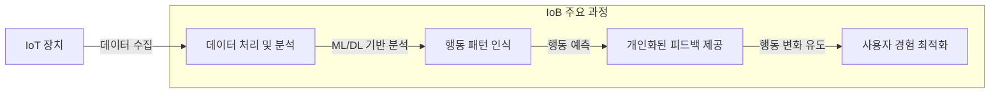

## IoB 개념

- IoT에서 생성되는 데이터를 기반으로 인간의 행동과 심리를 분석하는 기술적 접근 방식
- 개인화된 경험 제공, 행동 예측, 소비자 행동 모델링 / 프라이버시 침해, 데이터 편향 문제 등의 윤리적 논란

## IoB 개념도, 동작원리, 주요 영향

### IoB 개념도

### IoB 동작원리

| 구분 | 주요 과정 | 설명 |
| --- | --- | --- |
| 데이터 수집 | IoT 장치에서 데이터 획득 | 스마트워치, 스마트홈 기기 등에서 사용자 행동 데이터 수집 |
| 데이터 처리 및 분석 | 머신러닝 기반 분석 | 행동 패턴과 심리적 동기를 ML/DL로 분석 |
| 행동 변화 유도 | 개인 맞춤형 피드백 제공 | 분석 결과를 바탕으로 행동을 개선하는 피드백 전달 |

### IoB가 데이터 분석에 미치는 주요 영향

| 구분 | 주요 영향 | 설명 |
| --- | --- | --- |
| 개인화된 데이터 분석 | 맞춤형 분석 가능 | 개별 사용자의 행동과 환경을 고려한 서비스 제공 |
| 행동 예측 및 의사결정 지원 | 미래 행동 예측 | 소비 패턴 분석을 통해 맞춤형 혜택 제공 |
| 고객 여정 최적화 | 구매 과정 개선 | 고객의 클릭 및 구매 데이터를 활용한 추천 알고리즘 적용 |
| 사회적 가치 창출 | 공공 데이터 활용 | 스마트 시티, 교통 시스템, 에너지 절약 등의 공공 문제 해결 |

## IoB 도입시 고려사항

| 구분 | 고려사항 | 해결 방안 |
| --- | --- | --- |
| 프라이버시 침해 우려 | 데이터 수집 과정에서 개인정보 유출 가능 | 데이터 익명화 및 동의 기반 데이터 수집 방식 적용 |
| 데이터 편향 문제 | 특정 집단에 편향된 데이터로 분석 공정성 저하 | 다양한 출처의 데이터를 통합하여 편향 최소화 |
| 윤리적 책임 | 행동 유도가 특정 결과를 강제할 가능성 | AI 윤리 기준을 기반으로 투명한 데이터 처리 및 피드백 제공 |
