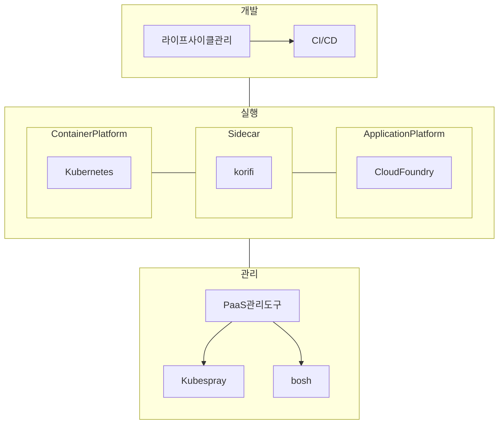

## K-PaaS 개념

- 개방형 클라우드 플랫폼 표준모델(K-PaaS 표준모델, 오픈소스)과 이를 기반으로 K-PaaS 적합성을 인증받은
클라우드플랫폼서비스와 솔루션들을 통칭
- HW자원의 효율적 활용, SW자원의 신속한 제공, 간편한 SW유지보수, 안정적 시스템 운영, ==클라우드 이동성 확보==

## K-PaaS 구성도, 인증 대상

### K-PaaS 인증 대상

| 구분 | 대상 | 내용 |
| --- | --- | --- |
| K-PaaS 적합성 인증 | PaaS | K-PaaS 코어, API 지원 취약점 점검 통과한 클라우드 플랫폼 서비스 |
| K-PaaS 호환성 인증 | SaaS | 단일/멀티 클라우드 플랫폼에서 배포 및 운용가능한 클라우드 서비스 |
| K-PaaS 호환성 연동형 인증 | 백엔드 서비스 | K-PaaS와 연동을 통해 제공하는 DB, Queue 등 백엔드 클라우드 서비스 |

### K-PaaS 인증 절차

## K-PaaS 고려사항

- ==재난관리 의무 사업자==들의 멀티 클라우드 도입을 위한 K-PaaS 고려 필요

## 참조

- [K-PaaS: 소개](https://k-paas.or.kr/intro/history)
