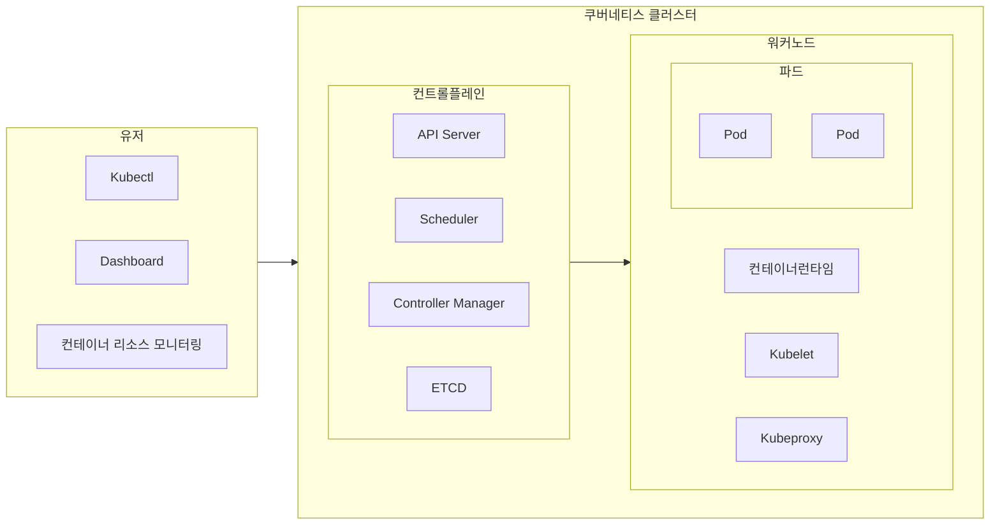

## 쿠버네티스 개념

- 컨테이너화 된 워크로드와 서비스를 관리하기 위해 이식성과 확장성을 갖춘 오픈소스 오케스트레이션 플랫폼
- 서비스 디스커버리, 스토리지 오케스트레이션, 자동화 롤아웃, 롤백

## 쿠버네티스 구성도, 구성요소

### 쿠버네티스 구성도

### 쿠버네티스 구성요소

| 구분 | 구성요소 | 역할 |
| --- | --- | --- |
| 유저 | Kubectl | 클러스터 관리 CLI |
| | Dashboard | 클러스터 관리 웹 UI |
| | 컨테이너 리소스 모니터링 | 컨테이너 시계열 로그 모니터링 |
| 컨트롤플레인 | API Server | 명령어 전달, ETCD 통신 |
| | Scheduler | Pod, 서비스 등 자원할당 |
| | Controller Manager | 컨틀로러 생성, 노드 배포 |
| | ETCD | 클러트더 데이터 KV 저장소 |
| 워커노드 | Pod | 기본 배포단위, 컨테이너 포함 |
| | 컨테이너 런타임 | Pod 통한 배포컨테이너 실행 환경 |
| | Kubelet | 에이전트, Pod 동작 관리 |
| | Kubeproxy | NW프록시, 로드밸런싱 |
