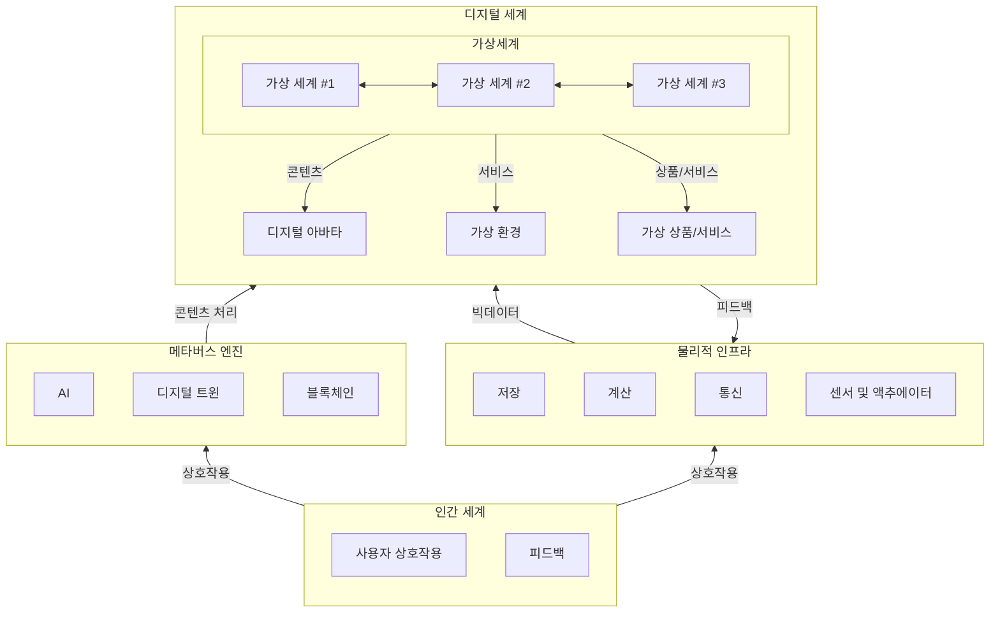

## 메타버스 시스템 개념

- 생성형 AI와의 융합으로 더욱 정교한 콘텐츠 생성 및 사용자 상호작용 가능한 메타버스 구현
- AI 기반 디지털 트윈, 블록체인 기술 통합, 초연결 네트워크

## 메타버스 시스템 구성도, 구성요소, 구축방안

### 메타버스 시스템 구성도

### 메타버스 시스템 구성요소

| 구분 | 구성요소 | 설명 |
| --- | --- | --- |
| 디지털 세계 | 연결된 가상 세계 | 다양한 가상 세계(가상 환경, 상품/서비스, 아바타 등)가 상호 연결되어 콘텐츠와 서비스 제공 |
| 메타버스 엔진 | AI | 콘텐츠 추천, 번역, 장면 생성 등 고도화된 사용자 경험을 지원 |
| | 디지털 트윈 | 물리적 세계를 가상으로 복제하여 실시간 데이터 통합 및 시뮬레이션 지원 |
| | 블록체인  | NFT, 스마트 계약 등을 통한 가상 경제와 디지털 소유권 보장 |
| 물리적 인프라 | 스토리지 | 로컬 캐싱, 엣지 캐싱, 클라우드 저장소를 활용한 고속 데이터 처리 |
| | 컴퓨팅 | 클라우드-엣지 연산을 통해 복잡한 모델 학습 및 실시간 데이터 분석 지원 |
| | 네트워크 | 5G, 위성 통신, IoT 등을 활용한 안정적인 연결성 제공 |
| | 센서 및 액추에이터 | AR/VR 장치, 카메라, 모션 센서 등으로 물리적 세계 데이터 실시간 수집 |
| 인간 세계 | 사용자 상호작용 | 디지털 아바타와의 상호작용을 통해 몰입형 경험 제공 |

### 메타버스 시스템 구축방안

- 메타버스 유형 분석 후 AI, 블록체인, 디지털 트윈 등 필요 기술을 식별하여 세부 설계

## 참조

- [IITP: 주간기술동향 2160호](https://iitp.kr/kr/1/knowledge/periodicalViewA.it?searClassCode=B_ITA_01&masterCode=publication&identifier=1345)
