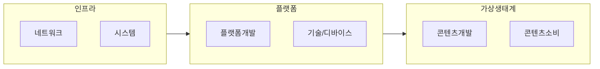

## 메타버스의 개념

- 증강현실, 라이프로깅, 미러링, 가상현실을 포함한 사용자들이 아바타를 통해 소통하고 경제활동을 하는 등 현실과 유사한 경험을 할 수 있는 공간

## 메타버스의 구성도, 구성요소, 활용방안

### 메타버스의 구성도

### 메타버스의 구성요소

| 구분 | 내용 | 비고 |
| --- | --- | --- |
| 인프라 | 메타버스 구현을 위한 HW, NW기술 | 5G, 클라우드 컴퓨팅 |
| 플랫폼 | 메타버스 서비스 제공 기반 환경 | 제페토, 로블록스 등 |
| 컨텐츠 | 메타버스 내 제공, 생산가능한 서비스 및 상품 | 게임, 금융, 쇼핑 등 |

- Canon, Creator, Currency, Continuity, Connectivity 5C 특징을 만족시키기 위한 설계 고려

### 메타버스 활용방안

| 구분 | 내용 | 비고 |
| --- | --- | --- |
| 공공 | 행정 서비스 접근성, 문화유산 체험 | 가상민원실, 가상박물관 |
| 금융 | 고객 편의성 증대, 메타버스 경제 | 가상지점, NFT 상품 |
| 민간 | 시공간 제약 없는 교육, 협업 | 원격근무, 강의 |

## 메타버스 고려사항

- 메타버스를 개발, 운영, 사용하는 모든 사회 구성원은 메타버스의 3대 지향원칙과 8대 윤리원칙을 지키기 위해 노력해야함.
- ==공간 컴퓨팅==
