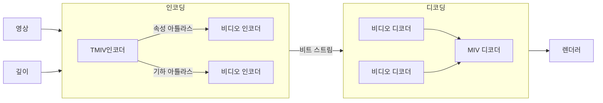

## MIV 개념

- 다수의 카메라로 3D 캡쳐한 영상을 6DoF지원하여 압축하는 비디오 압축 표준
- VR, AR 등 몰입형 미디어에 대한 압축 지원

## MIV 구성도, 구성요소, 적용방안

### MIV 구성도

==아틀라스==

### MIV 구성요소

| 구분 | 기술 | 내용 |
| --- | --- | --- |
| 인코더 | TMIV 인코더 | 다수의 텍스터, 기하정보 활용 인코딩 |
| | 비디오 인코더 | 공간 중복 제거 후 인코딩, 아틀라스 포맷기반 HEVC, VCC 코덱으로 전송 |
| 디코더 | 비디오 디코더 | 비트스트림을 영상으로 디코딩, 아틀라스 포맷으로 MIV 디코더 전달 |
| | MIV 디코더 | 후처리, 공간 시점 영상 합성, 사용자 움직임에 따른 뷰포트 생성 |

### MIV 적용방안

| 구분 | 방안 | 비고 |
| --- | --- | --- |
| VR, AR 컨텐츠 | 몰입감 높은 컨텐츠 제작 | 6DoF |
| 스포트 중계 | 다양한 시점에서 경기 관람 | 현장감 |
| 교육 컨텐츠 | 실감형 교육 컨텐츠 제작 | 체험형 |

## MIV 고려사항

- 압축 기술 뿐아니라 5G 네트워크를 통해 데이터를 1Gbps 이상으로 송신 필요
