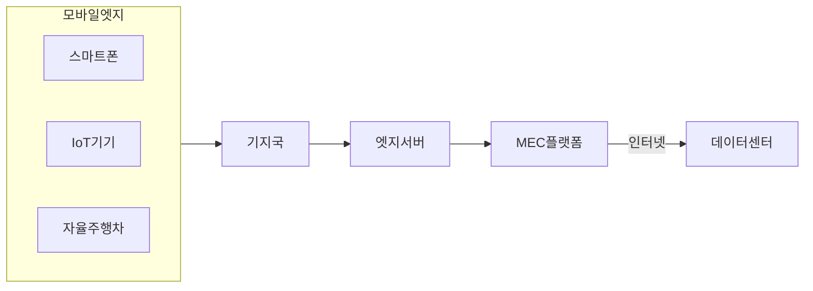

## 모바일 엣지 컴퓨팅 개념

- 기지국 근처 등 네트워크 엣지에 컴퓨터 자원을 분산시켜 데이터 처리 및 서비스를 제공하여 저지연, 고대역, 실시간 응답을 구현한 컴퓨팅 패러다임

## 모바일 엣지 컴퓨팅 구성도, 구성요소

### 모바일 엣지 컴퓨팅 구성도

### 모바일 엣지 컴퓨팅 구성요소

| 구분 | 내용 | 비고 |
| --- | --- | --- |
| 모바일 엣지 디바이스 | 데이터 생성 및 서비스 사용 주체 | 스마트폰, IoT기기 등 |
| 기지국 | 데이터 전송 및 통신 담당 | 무선 네트워크 |
| 엣지서버 | 네트워크 가장자리에 배치 | 데이터 처리, 저장 |
| MEC 플랫폼 | 엣지서버 관리, 모바일 서비스 제공 | 관리, 운영 |

## 모바일 엣지 컴퓨팅 고려사항

| 구분 | 내용 | 비고 |
| --- | --- | --- |
| 관리적 | 표준화, 데이터 권한 관리 | 보안성 |
| 기술적 | 네트워크 대역폭 관리, 서버 관리 | 안정성 |
| 물리적 | 엣지서버 위치, 전력 공급 | 효율성 |
