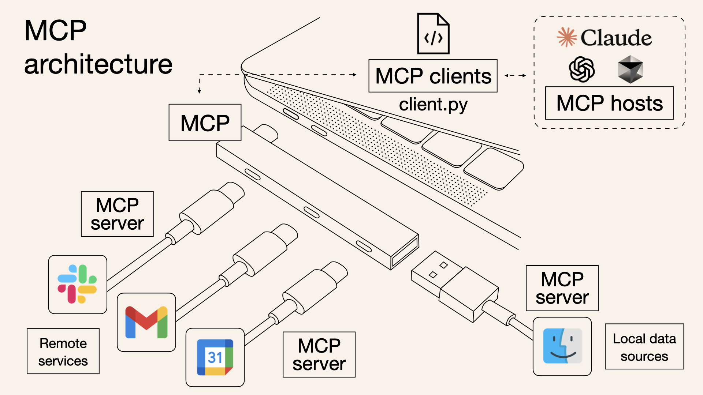
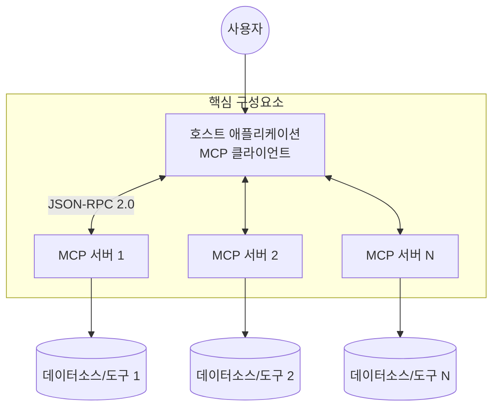

## MCP 개요

### MCP 개념

- AI 모델이 외부 데이터 소스 및 도구와 원활하게 통합될 수 있도록 하는 개방형 프로토콜
- 2024년 11월에 Anthropic에서 오픈 소스로 공개, AI 생태계에서 USB-C 포트와 같은 역할을 수행

### MCP 등장배경

- 정보 사일로, 데이터 고립 해결
- AI 모델 통합시 각 데이터소스마다 사용자 정의 코딩으로 인한 비효율 -> AI 시스템의 활용 범위 제한
- AI 에이전트와 에이전틱 워크플로우 발전 -> 실제 비즈니스 시스템과 데이터의 통합 필요성 대두

## MCP 구성도, 구성요소, 활용방안

### MCP 구성도





### MCP 구성요소

| 구분 | 설명 | 기능 |
| --- | --- | --- |
| 호스트 | LLM 애플리케이션으로, MCP 연결 시작점 | 사용자로부터 질문이나 명령을 받아 모델에게 전달하고, 모델의 응답을 사용자에게 보여주는 전체 흐름 조율 |
| 클라이언트 | 호스트 애플리케이션 내에서 서버와 1:1 연결을 유지 | 서버로 요청을 보내고 응답을 받아 모델에 전달 |
| MCP 서버 | 클라이언트에 컨텍스트, 도구, 프롬프트를 제공 | 각 서버는 특정 기능을 표준화된 모델 컨텍스트 프로토콜을 통해 노출 |
| MCP 리소스 | AI가 컨텍스트로 불러올 수 있는 데이터 소스 | 파일, 문서 또는 데이터베이스 쿼리와 같은 데이터 소스 접근 제공 |
| MCP 도구 | AI가 수행할 수 있는 작업 | API 호출을 하거나 명령을 실행하는 것과 같은 기능 제공 |
| 프롬프트 | LLM 상호작용을 위한 재사용 가능한 템플릿 | 특정 시나리오에서 AI의 행동을 안내 |
| 통신 프로토콜 | JSON-RPC 2.0 기반 표준 메시지 형식 | 클라이언트와 서버 간의 통신 규약 정의 |
| 전송 레이어 | 표준 입출력(stdin/stdout) 또는 HTTP(SSE) | 클라이언트와 서버 간의 통신 채널 제공 |

### MCP 활용방안

| 구분 | 내용 | 사례 |
| --- | --- | --- |
| 기업용 솔루션 | 기업 내부 데이터 접근 및 통합 | Slack(대화 기록, 채널 정보), Google Drive(문서 검색), 데이터베이스(Postgres, SQLite) 등 업무 도구 통합 |
| 개발 도구 | 코드 컨텍스트 및 개발 환경 통합 | GitHub, Sourcegraph, Replit, Codeium, Zed 등 개발 플랫폼과 통합, 코드 리포지토리 상호작용 |
| 개인 생산성 | 개인 정보 관리 및 자동화 | 이메일 관리(Gmail), 캘린더, 작업 관리, Puppeteer를 통한 웹 브라우징 |
| 데이터 분석 | 데이터 소스 접근 및 분석 | 멀티모달 데이터 분석, 모니터링 시스템(Cloudflare, Sentry) 통합 |
| AI 에이전트 개발 | 복잡한 워크플로우 자동화 | RAG(Retrieval-Augmented Generation) 시스템, 복잡한 작업 조정을 위한 AI 에이전트 프레임워크 |
| 보안 및 규정 준수 | 안전한 데이터 접근 및 통제 | 민감한 데이터에 대한 제어된 접근, 권한 관리, 감사 로깅 |

## MCP, LSP 차이점

> [MCP는 LSP, Language Server Protocol에서 영감 받음](https://spec.modelcontextprotocol.io/specification/2024-11-05/#overview)

| 구분 | LSP | MCP |
| --- | --- | --- |
| 목적 | 개발 도구와 언어 서버 간 통신 표준화 | AI 모델과 외부 데이터 소스 및 도구 간 통합 표준화 |
| 활용 영역 | 코드 편집기, IDE에서 언어 기능 제공 | AI 애플리케이션에서 외부 데이터 접근 및 도구 활용 |
| 핵심 기능 | 자동 완성, 정의로 이동, 오류 진단 등 | 컨텍스트 제공, 도구 호출, 데이터 접근 등 |
| 아키텍처 | 클라이언트(편집기)-서버(언어 서비스) | 클라이언트(AI 앱)-서버(데이터 소스/도구) |
| 통신 방식 | JSON-RPC 2.0 | JSON-RPC 2.0 |
| 통신 채널 | stdin/stdout, 명명된 파이프, 소켓(TCP) | stdin/stdout, HTTP + SSE(Server-Sent Events) |
| 개발 주체 | Microsoft | Anthropic |
| 공개 시기 | 2016년 | 2024년 11월 |
| 영감 출처 | V8 디버거 프로토콜 | 부분적으로 LSP에서 영감을 받음 |
| 주사용자 | 프로그래밍 언어 서비스 개발자, 도구 제작자 | AI 모델 개발자, 데이터 통합 엔지니어 |

## MCP 예시 코드

```ts
#!/usr/bin/env node
import { Server } from "@modelcontextprotocol/sdk/server/index.js";
import { StdioServerTransport } from "@modelcontextprotocol/sdk/server/stdio.js";
import {
  ListToolsRequestSchema,
  CallToolRequestSchema,
  McpError,
  ErrorCode
} from "@modelcontextprotocol/sdk/types.js";

// MCP 서버 인스턴스 생성
const server = new Server({
  name: "mcp-simple-server",
  version: "1.0.0",
});

// 도구 목록 제공 핸들러
server.setRequestHandler(ListToolsRequestSchema, async () => {
  return {
    tools: [{
      name: "calculate_sum",
      description: "두 숫자를 더합니다",
      inputSchema: {
        type: "object",
        properties: {
          a: { type: "number" },
          b: { type: "number" }
        },
        required: ["a", "b"]
      }
    }]
  };
});

// 도구 호출 핸들러
server.setRequestHandler(CallToolRequestSchema, async (request) => {
  if (request.params.name === "calculate_sum") {
    const { a, b } = request.params.arguments;
    return { toolResult: a + b };
  }
  
  throw new McpError(ErrorCode.ToolNotFound, "도구를 찾을 수 없습니다");
});

// 표준 입출력을 통한 MCP 서버 연결
const transport = new StdioServerTransport();
await server.connect(transport);
```

- [Github: cloudflare/mcp-server-cloudflare](https://github.com/cloudflare/mcp-server-cloudflare/tree/main/src/tools) 예시가 알기 쉬움
