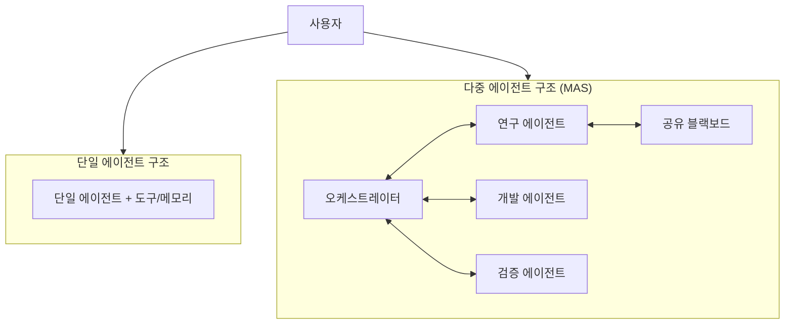

## 다중 에이전트 시스템(MAS) 개념

- **다중 에이전트 시스템(MAS, Multi-Agent System)이란** 하나의 환경에서 ==자율성·반응성·능동성·사회성==을 갖춘 다수의 에이전트가 통신·협상·조정을 통해, 단일 에이전트로 해결하기 어려운 ==복잡한 대규모 문제를 분산 협업으로 해결==하는 지능형 시스템 아키텍처이다.
- 단일 거대 LLM의 할루시네이션, 제한된 컨텍스트 윈도우, 다단계(Multi-step) 태스크의 성능 저하를 극복하기 위해 역할을 특화(Divide & Conquer)하고, A2A(Agent-to-Agent) 협업과 MCP(Model Context Protocol) 도구 연동으로 신뢰성과 비용 효율을 동시에 확보하려는 필요성에서 대두되었다.

## 다중 에이전트 시스템 구성도, 핵심요소, 적용방안

### 단일 에이전트와 다중 에이전트의 구조 대비도

### 다중 에이전트 시스템의 핵심 구성요소

| 구분 | 핵심요소 | 설명 |
| --- | --- | --- |
| **에이전트(Agent)** | 자율성, 반응성, 능동성, 사회성 | 역할(Persona)별로 특화된 자율 의사결정 단위 |
| **오케스트레이션** | Supervisor, Graph 기반 라우팅 | LangGraph·CrewAI로 태스크 위임·흐름 제어 |
| **A2A 프로토콜** | Agent Card, JSON-RPC 기반 협업 | 에이전트 간 능력 발견·태스크 위임 고수준 규격 |
| **MCP** | Tool·Resource·Context 연동 | 개별 에이전트의 도구·데이터 접근 저수준 규격 |
| **공유 상태** | Blackboard, State Persistence | 메모리 동기화 및 협력적 의사결정 기반 |

### 다중 에이전트 시스템 적용방안

| 구분 | 내용 | 비고 |
| --- | --- | --- |
| **비즈니스 관점** | SDLC·공급망(SCM) 등 End-to-End 업무 자동화 | Human-in-the-loop 최소화 |
| **기술 관점** | 역할별 sLLM 분산 배치로 토큰 비용 최적화 | LangGraph/CrewAI/AutoGen |
| **보안 관점** | 내부 메모리 비공유 협업으로 IP 보호 | A2A Agent Card 기반 인증 |

## 단일 에이전트와 다중 에이전트 시스템의 비교

| 구분 | 단일 에이전트(Single-Agent) | 다중 에이전트(Multi-Agent, MAS) |
| --- | --- | --- |
| **아키텍처** | 중앙 집중형 독립 구조 | 분산형 자율 협업·오케스트레이션 구조 |
| **상호작용** | 모델 내부 도구 호출(Tool Call) | 에이전트 간 통신(A2A Protocol) |
| **내결함성** | 단일 실패점(SPOF), 오류 시 전체 중단 | 개별 에이전트 대체·자율 복구 가능 |
| **확장성** | 컨텍스트·도구 증가 시 성능 저하 | 신규 전문 에이전트 동적 추가로 확장 |

> **기술적 시사점:** 단일 에이전트는 단순 Q&A에 최적이나, 복잡한 자율 워크플로우(Agentic Workflow)의 신뢰성과 확장성을 확보하려면 분산 협업형 MAS로의 전환이 효과적이다.

## 다중 에이전트 시스템 적용전략

- **상호 검증 기반 신뢰도 향상:** 서로 다른 관점의 에이전트가 결과를 토론(Debate)·자아 성찰(Self-Reflection)하여 할루시네이션을 억제하고 의사결정 정확도를 높인다.
- **A2A와 MCP의 상호 보완 통합:** 고수준의 에이전트 간 협업은 A2A로, 개별 에이전트의 도구·데이터 접근은 MCP로 처리하는 이중 규격 하이브리드 아키텍처로 수렴한다. 두 표준은 각각 별도 거버넌스로 오픈 표준화가 진행되어, A2A는 2025년 6월 Google이 Linux Foundation에 기증해 Agent2Agent 프로토콜 프로젝트로 운영되고, MCP는 2025년 12월 Anthropic이 Linux Foundation 산하 directed fund인 Agentic AI Foundation(AAIF)에 기증하였다.
- **프레임워크 선택 전략:** 복잡·대규모 상태 오케스트레이션은 LangGraph, 역할 기반 협업은 CrewAI, 대화형 합의는 AutoGen을 활용하되, 조직 요구에 따라 혼합 적용한다.

## 다중 에이전트 시스템 도입 시 고려사항

| 구분 | 문제점 | 해결방안 |
| --- | --- | --- |
| **기술** | 에이전트 간 의견 충돌로 무한 루프·데드락 발생 | 최대 대화 횟수(Max Rounds) 제한, 오케스트레이터 상태 조율·조기 종료 |
| **제도** | 자율 의사결정의 책임 소재·통제 불명확 | 온톨로지 기반 역할 사전 정의, AgentOps 거버넌스·감사 로깅 |
| **비즈니스** | 메시지 교환 증가로 레이턴시·토큰 비용 누적 | 비동기 메시징, 공유 블랙보드 활용, 경량 sLLM 융합 설계 |

향후 MAS는 A2A·MCP 표준화와 AgentOps 거버넌스 위에서, 멀티 프레임워크가 도구를 공유하는 차세대 지능형 자동화 인프라로 발전할 전망이다.

## 참조

- [Linux Foundation Launches the Agent2Agent Protocol Project (2025-06-23)](https://www.linuxfoundation.org/press/linux-foundation-launches-the-agent2agent-protocol-project-to-enable-secure-intelligent-communication-between-ai-agents)
- [Google Cloud donates A2A to Linux Foundation - Google Developers Blog](https://developers.googleblog.com/en/google-cloud-donates-a2a-to-linux-foundation/)
- [Donating the Model Context Protocol and establishing the Agentic AI Foundation - Anthropic (2025-12-09)](https://www.anthropic.com/news/donating-the-model-context-protocol-and-establishing-of-the-agentic-ai-foundation)
- [LangGraph vs AutoGen vs CrewAI: Framework Comparison & Architecture Analysis](https://latenode.com/blog/platform-comparisons-alternatives/automation-platform-comparisons/langgraph-vs-autogen-vs-crewai-complete-ai-agent-framework-comparison-architecture-analysis-2025)
