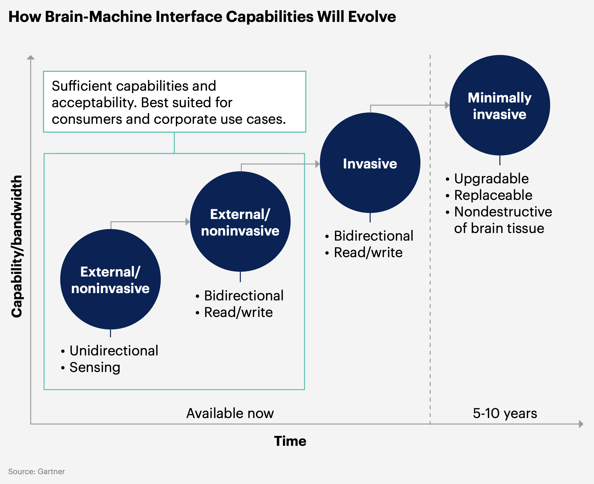

## 신경학적 향상 개념

- 인간의 뇌 활동을 읽고 해석하며, 선택적으로 뇌에 데이터를 쓰는 기술을 활용하여 인간의 인지 능력을 향상시키는 과정
- 인지 능력 강화, 학습 및 작업 효율, 의료 혁신(시력, 청력), 차세대 마케팅

## 신경학적 향상 개념도, 핵심요소, 활용방안

### 신경학적 향상 개념도

- ==외부/비침습 (센싱, 단방향->양방향통신)== -> ==침습 (양방향통신)== -> ==최소 침습(교체가능, 업그레이드가능, 비파괴성)==

### 신경학적 향상 핵심요소

| 구분 | 핵심요소 | 설명 |
| --- | --- | --- |
| 소프트웨어 | ==BBMI==(Bidirectional Brain-Machine Interfaces) | 뇌와 기계 간 양방향 통신으로 데이터 수집 및 처리 가능 |
| | 전기 자극 및 데이터 디코딩 | 전기 신호를 통해 뇌 활동을 해독하고, 데이터를 기반으로 출력 제공 |
| 하드웨어 | 웨어러블 | 저렴하고 비침습적이며, 대규모 채택 가능성이 높음 |
| | 임플란트 | 침습적이지만 고성능을 제공하며, 더 높은 기능적 잠재력을 보유 |
| 응용분야 | 인지 능력 강화 | 기억력, 학습력, 문제 해결 능력을 향상시켜 작업 효율성을 높임 |
| | 데이터 수집 및 모니터링 | 사용자의 정신 상태와 감정 데이터를 실시간으로 분석 및 활용 |

### 신경학적 향상 활용방안

| 분야 | 사례 | 기대 효과 |
| --- | --- | --- |
| 의료 | 신경 질환 예방 및 치료 | 뇌 활동 분석을 통해 초기 경고 제공 및 환자 치료 효과 증대 |
| 교육 | 맞춤형 학습 자료 제공 | 학습 데이터를 기반으로 최적화된 교육 경험 제공 |
| 산업 안전 | 작업 환경 모니터링 및 사고 예방 | 작업자 상태를 실시간으로 모니터링하고, 사고 위험 최소화 |
| 마케팅 | 소비자 행동 예측 및 맞춤형 제안 | 실시간 데이터를 통해 고객의 욕구를 이해하고 대응 |
| 직원 성과 | 피로 방지 및 업무 성과 유지 | 경계 상태를 유지하고 효율성을 극대화 |

## 신경학적 향상 고려사항

| 구분 | 고려사항 | 설명 |
| --- | --- | --- |
| 기술적 | 디코딩 정확도 및 시스템 통합 문제 | 뇌 데이터를 정확히 해석하고 다양한 데이터 시스템과 통합 필요 |
| 사회적 | 침습적 기술에 대한 거부감 | 웨어러블 기술부터 단계적으로 채택 확대 |
| 윤리적 | 개인 데이터의 보안과 프라이버시 | 민감한 뇌 데이터를 보호하고, 무단 사용을 방지하기 위한 규제 필요 |
| 경제적 | 초기 기술 비용과 유지 관리 비용 | 가격 접근성을 개선하고, 저비용 솔루션을 개발 |
| 보안 | 시스템의 새로운 취약성 | 뇌-기계 인터페이스 관련 보안 위협을 방지하기 위한 강력한 암호화 및 보호 장치 필요 |
