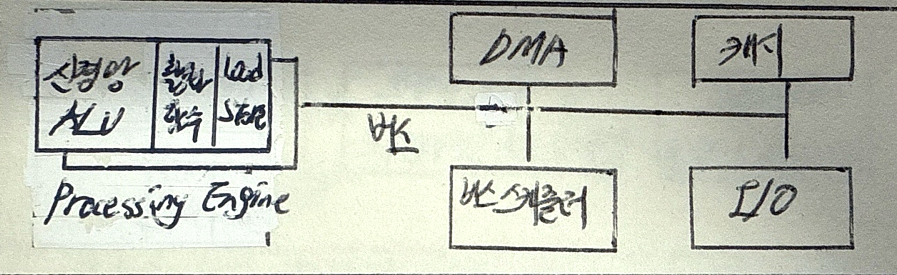

## NPU 개념

- AI, 딥러닝 활용을 위해 행렬연산 등 대량 병렬처리를 효과적으로 수행할 수 있는 차세대 반도체
- 저전력, 고성능, 고효율, 온디바이스 AI, ML Framework 지원

## NPU 구성도, 구성요소, GPU 비교

### NPU 구성도

### NPU 구성요소

### CPU 구성 요소

| 구분 | 구성 요소 | 설명 |
| --- | --- | --- |
| 연산부 | 신경망 ALU | 뉴런 기반 산술 및 논리 연산을 수행하는 장치 |
| | 레지스터 | 연산 속도를 높이기 위해 데이터 및 명령어를 저장하는 초고속 메모리 |
| | Processing Engine | 명령어 실행 및 데이터 처리를 담당하는 핵심 연산 유닛 |
| 제어부 | 버스 스케줄러 | CPU 내 데이터 및 명령 전송을 최적화하는 스케줄링 장치 |
| | 버스 | CPU 내부 및 외부 장치 간 데이터 전송을 위한 경로 |
| 메모리부 | 캐시(Cache) | 자주 사용하는 데이터를 저장하여 CPU 접근 속도를 향상 |
| | DMA(Direct Memory Access) | CPU 개입 없이 데이터 전송을 수행하여 성능 최적화 |
| 입출력부 | I/O 컨트롤러 | 외부 장치와의 데이터 입출력을 관리 |

### NPU, GPU 비교

| 구분 | NPU | GPU |
| --- | --- | --- |
| 목적 | 딥러닝 및 AI 가속, 신경망 연산 최적화 | 그래픽 및 범용 병렬 연산 (GPGPU) |
| 특징 | 저전력, 고성능, 고효율, 최적화된 AI 연산 | 대량의 병렬 연산, 높은 메모리 대역폭 |
| 구조 | 활성화 함수, 신경망 ALU, 메모리 컨트롤러 | SP (Streaming Processor), SIMD, HBM |
| 연산 방식 | 행렬 연산(MAC, Matrix Multiply-Accumulate) 최적화 | 병렬 처리(벡터 연산, 픽셀 렌더링) |
| 데이터 처리 | 텐서 연산 최적화(Tensor Core, TPU 등) | 부동소수점 연산(FP32, FP64), 벡터 연산 |
| 활용 분야 | AI, 딥러닝, 엣지 컴퓨팅, 자율주행 | 3D 그래픽, 데이터 병렬처리, 게임, 영상처리 |
| 전력 소비 | 저전력 | 고전력 |
