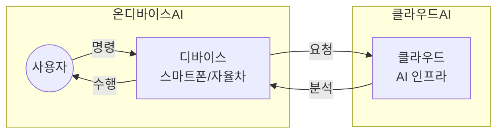

## 온디바이스 AI 개념

- 클라우드 서버를 거치지 않고 단말 자체에서 AI연산을 수행하는 기술
- 개인정보/데이터보호, 빠른 응답속도, 비용절감, 오프라인 AI

## 온디바이스 AI 구성도, 주요 기술

### 온디바이스 AI 구성도

### 온디바이스 AI 주요 기술

| 구분 | 주요기술 | 설명 |
| --- | --- | --- |
| HW 기술 | 뉴로모픽 | 신경망을 하드웨어적으로 구현하여 초저전력 AI 연산 수행 |
| | NPU | AI 연산 최적화 전용 프로세서로 CNN, RNN 등 가속 처리 |
| | HBM | 고대역폭 메모리로 AI 연산 시 병렬 처리 성능 향상 |
| | SoC | CPU, GPU, NPU 통합 설계로 AI 연산 최적화 및 전력 절감 |
| SW 기술 | 엣지컴퓨팅 | 데이터가 생성된 기기에서 직접 AI 연산 수행, 실시간 응답 가능 |
| | 경량 AI모델/알고리즘 | 모델 경량화, 저전력 최적화 기법으로 모바일·IoT 기기에서도 AI 실행 가능 |
| | MoE | 전문가 모델(Mixture of Experts)로 AI 연산 효율성 향상 |
| | BitNet | 저비트(1~2bit) 연산을 활용한 경량 AI 모델, 전력·메모리 사용 절감 |
| 개인정보보호 기술 | 차등프라이버시 | 데이터에 노이즈를 추가하여 개인정보 보호 강화 |
| | TPM | 신뢰할 수 있는 환경에서 AI 연산을 수행하는 보안 칩 활용 |
| | 데이터 로컬 처리 | 클라우드 전송 없이 기기 내에서 AI 데이터 처리, 보안 및 응답 속도 향상 |
