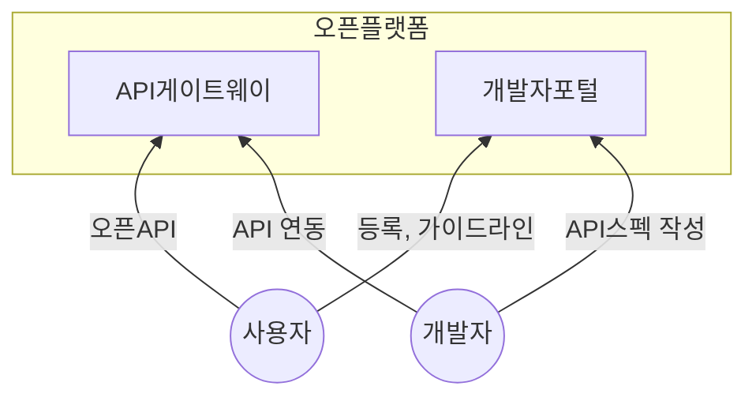

## 오픈플랫폼 개념

- 기업이 보유한 서비스, 정보 등을 쉽게 활용할 수 있도록하여 웹서비스 및 어플리케이션 개발을 지원하는 개방지향적 플랫폼

## 오픈플랫폼 구성도, 구성요소, 문제점

### 오픈플랫폼 구성도

- 사용자는 API 신청 이후 OpenAPI 인증 및 활용

### 오픈플랫폼 구성요소

| 구분 | 내용 | 비고 |
| --- | --- | --- |
| 사용자 | OpenAPI 활용 개발 주체 | 개발자, 기업 |
| 오픈API | 표준화된 API 명세 제공 | OpenAPI 3.0 |
| API게이트웨이 | 사용자 요청 검증, 라우팅, 캐싱 | 보안, 트래픽 처리 |
| 개발자포털 | 사용자에게 API 정보 제공 | SDK, 인증, 계정 발급 |

### 오픈API 문제점

- 외부 공개 APi로 데이터 노출, 악의적 사용에 대한 보안 위험
- API 업데이트 및 버전관리 어려움

## 오픈API문제 해결방안

| 구분 | 내용 | 비고 |
| --- | --- | --- |
| 기술적 | 인증 및 접근 권한 부여 | OAuth 2.0 |
| | 버전관리 및 문서화 | Swagger |
| 관리적 | 개인정보보호법, 정보통신망법 준수 | 오픈API 법규 제정 |
| | 사용량, 응답시간, 오류 모니터링 | 가용성 확보 |
