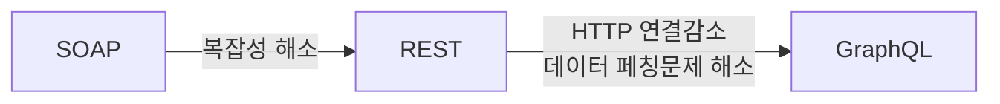
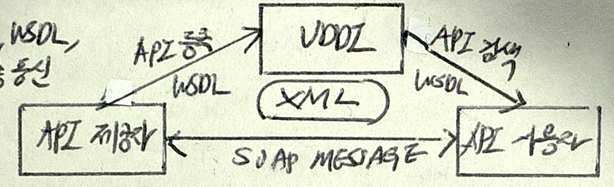
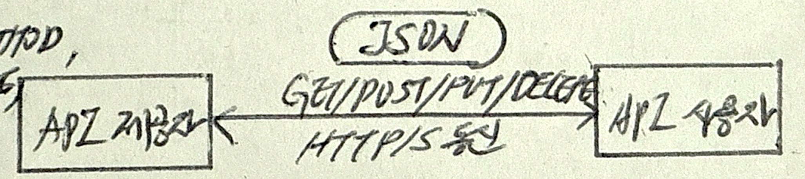

## 개방형 API 개념

```mermaid
graph LR 
  SOAP -->|복잡성 해소| REST --> |HTTP 연결감소<br/>데이터 페칭문제 해소| GraphQL
```

- 누구나 사용할 수 있도록 공개된 API로 웹표준 프로토콜과 버전관리를 통해 호환성, 확장성을 제공
- 개방형 API 호출 방식은 SOAP / REST / GraphQL 로 진화

## 개방형 API 호출 유형

### SOAP

### REST

