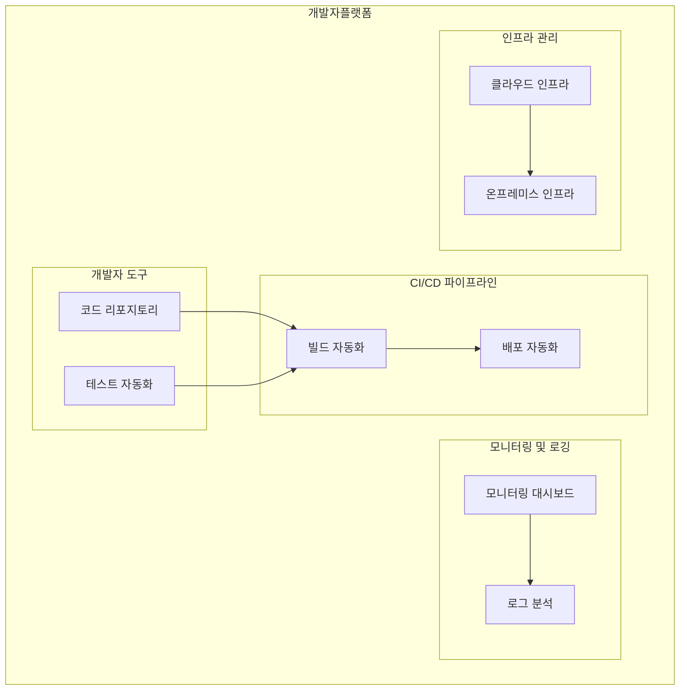

## 플랫폼 엔지니어링의 개념

- 다양한 애플리케이션과 서비스의 효율적 개발, 운영, 관리, 배포를 위해 공통된 플랫폼을 설계, 구축, 유지하는 엔지니어링 분야
- 개발 효율성 증대, 일관된 품질 확보, 공통된 플랫폼으로 시스템 유지보수 용이, 자동화로 인한 비용 절감

## 플랫폼 엔지니어링 구성도, 구성요소, 적용방안

### 플랫폼 엔지니어링 구성도

### 플랫폼 엔지니어링 구성요소

| 구분 | 내용 | 비고 |
|---|---|---|
| 개발자 도구 | 코드 리포지토리, 테스트 자동화 도구 | Git, Jenkins |
| CI/CD 파이프라인 | 빌드 자동화, 배포 자동화 | Jenkins, GitLab |
| 모니터링 및 로깅 | 모니터링 대시보드, 로그 분석 | Prometheus, ELK |
| 인프라 관리 | 클라우드 인프라, 온프레미스 인프라 | AWS, GCP, Azure |

### 플랫폼 엔지니어링 적용방안

| 구분 | 내용 | 비고 |
|---|---|---|
| 공공 | 공공 데이터와 서비스를 통합 관리하여 효율성 증대 | 데이터 통합 및 관리 효율성 향상 |
| 금융 | 데이터 암호화와 접근 제어를 통한 보안 강화 | 금융 데이터 보호 |
| 민간 | 모듈화된 아키텍처로 다양한 비즈니스 요구 대응 | 유연한 비즈니스 확장 |

## 플랫폼 엔지니어링시 고려사항

- 개발자가 아닌 조직 구성원이 쉽게 데이터를 확인하고, 사용할 수 있는 FaaS, Jupyter Notebook 인터페이스 제공
