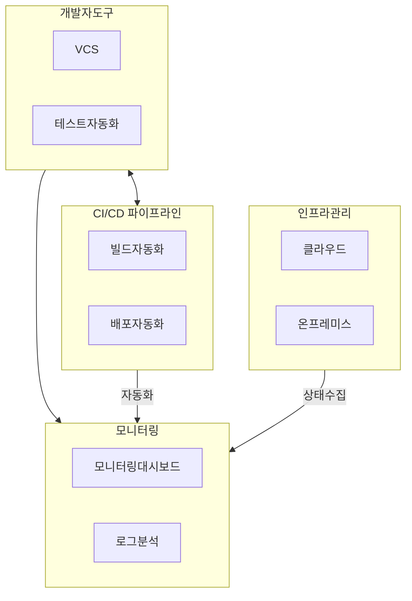

## 플랫폼 엔지니어링 개념

- 다양한 애플리케이션과 서비스의 효율적 개발, 운영, 관리, 배포를 위해 공통된 플랫폼을 설계, 구축, 유지하는 엔지니어링 분야
- 개발 효율성 증대, 일관된 품질 확보, 공통된 플랫폼으로 시스템 유지보수 용이, 자동화로 인한 비용 절감

## 플랫폼 엔지니어링 구성도, 구성요소, 적용방안

### 플랫폼 엔지니어링 구성도

- 개발/운영 간 필요 컴포넌트를 자동화, 지원, 관제하여 개발자생산성 향상

### 플랫폼 엔지니어링 구성요소

| 구분 | 내용 | 비고 |
|---|---|---|
| 개발자 도구 | 코드 리포지토리, 테스트 자동화 도구 | Git, Jenkins |
| CI/CD 파이프라인 | 빌드 자동화, 배포 자동화 | Jenkins, GitLab |
| 모니터링 및 로깅 | 모니터링 대시보드, 로그 분석 | Prometheus, ELK |
| 인프라 관리 | 클라우드 인프라, 온프레미스 인프라 | AWS, GCP, Azure |

### 플랫폼 엔지니어링 적용방안

| 구분 | 내용 | 비고 |
|---|---|---|
| 공공 | 공공 데이터와 서비스를 통합 관리하여 효율성 증대 | 데이터 통합 및 관리 효율성 향상 |
| 금융 | 데이터 암호화와 접근 제어를 통한 보안 강화 | 금융 데이터 보호 |
| 민간 | 모듈화된 아키텍처로 다양한 비즈니스 요구 대응 | 유연한 비즈니스 확장 |

## 플랫폼 엔지니어링, DevOps 비교

| 구분 | 플랫폼 엔지니어링 | DevOps |
| --- | --- | --- |
| 범위 | 전사적 DevOps 확장, 플랫폼 기반 개발 지원 | 개발 및 운영 자동화, CI/CD 중심 |
| 목표 | 개발자의 생산성 극대화, 일관된 SW 제공 | SDLC 주기 단축, 배포 자동화 |
| 역할 | 플랫폼 팀이 개발자에게 표준화된 개발 환경 제공 | DevOps 팀이 개발 및 운영을 자동화하고 협업 주도 |
| 구성 요소 | 개발자 포털, IDP, 셀프서비스 도구 | CI/CD, IaC, 모니터링, 컨테이너 오케스트레이션 |
| 초점 | DX 개선, 재사용 가능한 플랫폼 제공 | 자동화 및 협업, 지속적인 통합 및 배포 |
| 자동화 수준 | 개발자가 쉽게 인프라, 배포, 모니터링을 사용할 수 있도록 자동화 | 배포 및 운영을 자동화하여 지속적인 딜리버리 실현 |

## 플랫폼 엔지니어링시 고려사항

- 개발자가 아닌 조직 구성원이 쉽게 데이터를 확인하고, 사용할 수 있는 FaaS, Jupyter Notebook 인터페이스 제공
