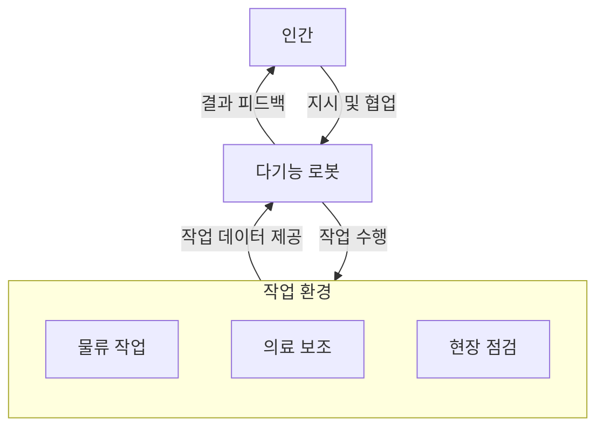
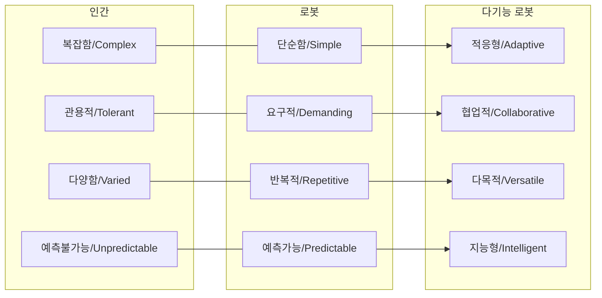

## 다기능 로봇 개념

- 단일 기능 로봇과 달리 다양한 환경에서 다양한 작업을 수행할 수 있는 능력을 가지고, 인간의 지시나 예시를 따라 여러 작업을 수행할 수 있는 로봇
- 효율성 증대, 노동력 부족 대응, 유연성, 비용 절감, 협업 강화

## 다기능 로봇 개념도, 핵심요소, 활용방안

### 다기능 로봇 개념도

### 다기능 로봇 핵심요소

| 구분 | 핵심요소 | 설명 |
| --- | --- | --- |
| 설계 유연성 | 모듈형 설계 | 다양한 작업과 환경에 맞게 쉽게 조정 가능 |
| 작업 능력 | 반복 작업 처리 | 단순하고 예측 가능한 작업을 신속히 처리 |
| | 복잡한 작업 수행 | 복잡하고 비정형 작업을 처리하여 인간과 협력 가능 |
| 센싱 및 통신 | 센서 통합 | 주변 환경에 대한 실시간 데이터 수집 및 분석 |
| | 네트워크 연결 | 클라우드 기반 실시간 데이터 교환 및 협업 지원 |

### 다기능 로봇 활용방안

| 분야 | 활용 사례 | 기대 효과 |
| --- | --- | --- |
| 물류 | 물품 포장 및 운송 | 작업 시간 단축 및 비용 절감 |
| 의료 | 의료 물품 전달 및 환자 보조 | 의료 환경의 생산성과 효율성 향상 |
| 제조업 | 현장 점검 및 유지보수 | 다운타임 감소 및 작업 안전성 증대 |
| 소매업 | 고객 서비스 및 상품 관리 | 고객 경험 향상 및 운영 효율성 개선 |

## 다기능 로봇 활용시 고려사항

| 구분 | 고려사항 | 내용 |
| --- | --- | --- |
| 기술적 측면 | 로봇 통합성 및 표준화 | 로봇 간 상호작용과 워크플로 통합을 위한 표준 기술 개발 필요 |
| 경제적 측면 | 초기 도입 비용 | 초기 투자 비용 대비 ROI 평가와 장기적 비용 절감 전략 수립 필요 |
| 사회적 측면 | 인간-기계 협력 이슈 | 인간과 로봇 간 작업 분담 및 협업을 위한 조직 문화 및 정책 개발 필요 |
| 안전 및 보안 | 작업장 내 안전성 | 인간 작업자와의 협업에서 안전 규정 준수 및 로봇의 자율성 관리 |
