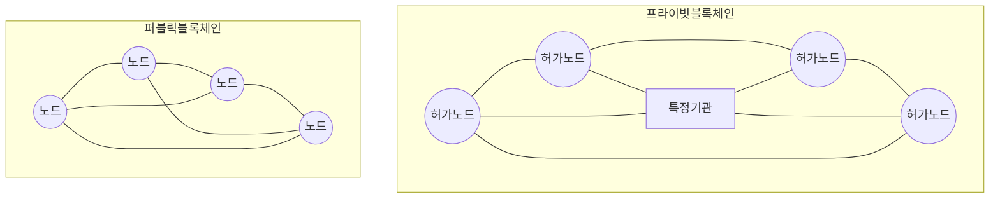

## 블록체인 개요

### 블록체인 개념

- 탈중앙화된 P2P 네트워크를 기반에 합의알고리즘을 통해 무결성을 제공하는 분산 원장 기술

### 블록체인 배경

- 합의속도와 보안성 강화를 위해 프라이빗 블록체인 등장, 투명성과 분산성을 향상시키기 위해 하이브리드 블록체인 확장

## 퍼블릭 블록체인, 프라이빗 블록체인 구성도, 구성요소 비교, 한계점

### 퍼블릭 블록체인, 프라이빗 블록체인 구성도

- 프라이빗 블록체인은 특정 통제 기관에서 트랜잭션 합의 처리

### 퍼블릭 블록체인, 프라이빗 블록체인 구성요소

| 구분 | 퍼블릭 블록체인 | 프라이빗 블록체인 |
| --- | --- | --- |
| 참여주체 | 누구나 | 지정된 사용자 |
| 소유자 | 없음 | 특정 기관 |
| 탈중앙성 | 높음 | 낮음 |
| 확장성 | 낮음 | 높음 |
| 보안성 | 낮음 | 높음 |
| 투명성 | 높음 | 낮음 |
| 트랜잭션 속도 | 느림 | 빠름 |
| 합의알고리즘 | PoW, PoS | PBFT, Raft 등 |

### 퍼블릭 블록체인, 프라이빗 블록체인 한계점

- 퍼블릭 블록체인은 투명성과 탈중앙성이 높지만, 속도와 확장성이 낮음
- 프라이빗 블록체인은 속도와 확장성이 높지만, 투명성, 분산성이 낮아 하이브리드 모델 등장

## 하이브리드 블록체인 개념, 특징

### 하이브리드 블록체인 개념

- 퍼블릭 블록체인과 프라이빗 블록체인의 장점 결합, 일부 데이터를 공개로 유지하고 민감 데이터를 비공개 트랜잭션 처리

### 하이브리드 블록체인 특징

| 구분 | 내용 | 비고 |
| --- | --- | --- |
| 참여주체 | 일부 공개, 일부 허가된 사용자 | 퍼블릭, 프라이빗 체인 혼합 |
| 탈중앙성 | 부분 탈중앙화 | 퍼블릭 체인의 장점 |
| 합의 알고리즘 | DPoS 등 혼합 | 다양한 합의알고리즘 사용 |

### 하이브리드 블록체인 활용방안

| 구분 | 내용 | 비고 |
| --- | --- | --- |
| 공공 | 투명성 요구 높은 공공기록 관리 | 민감데이터 프라이빗 체인 |
| 금융 | 금융 거래 투명성 | 고객 정보 프라이빗 체인 |
| 민간 | 기업 내부 기록, 거래 스마트 계약 | 비지니스 민첩성, 보안성 |

- 다양한 요구사항에 따라 데이터 접근, 검증방식 조절 가능
