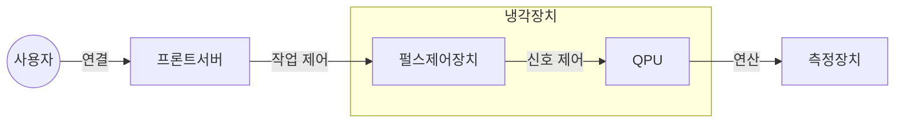

## 양자컴퓨터의 개요

### 양자컴퓨터의 개념

- 0,1 을 중첩시키는 큐비트를 기반으로 고속연산을 처리하는 차세대 컴퓨터

### 양자컴퓨터의 필요성

- 기존 컴퓨터는 복잡한 문제 해결에 한계점
- 양자 컴퓨터 도입으로 분자 시뮬레이션, 우주 시뮬레이션, 신약개발, 인공지능, 조합 최적화 문제들을 개선 및 해결 가능

## 양자컴퓨터의 구성도, 구성요소, 구현방법

### 양자컴퓨터 구성도

### 양자컴퓨터 구성요소

| 구분 | 내용 | 비고 |
| --- | --- | --- |
| 프론트서버 | 문제입력, 작업제어, 결과분석 | 클라우드 기반 |
| ==펄스제어장치== | 큐비트 제어신호 생성, 전송 | 전기적, 광학적 제어 |
| ==QPU== | 큐비트 연산 수행 | 다양한 구현기술 |
| ==측정장치== | 큐비트 상태 측정 | 바이너리 데이터 |
| 냉각장치 | 극저온 환경 유지 | 절대영도 필요 |

### 양자컴퓨터 구현방법

| 구분 | 내용 | 비고 |
| --- | --- | --- |
| 초전도형 양자비트 | 초전도 상태로 전류를 흘려 전하로 양자표현 | 극저온 환경 |
| 이온트랩형 양자비트 | 레이저로 이온 보충, 들뜬 상태 유지 | 높은 신뢰성 |
| 실리콘형 양자비트 | 실리콘에 전자를 삽입하여 전자기파로 양자 표현 | 양자얽힘 구현 어려움 |
| 토폴로지컬형 양자비트 | 준입자 활용 양자 표현 | 기술적 한계 |
| 다이아몬드결손형 양자비트 | 전자를 사용하여 양자표현  | 상온 작동 가능성 |

- Azure Quantum 등 CSP 제공 양자컴퓨터 서비스 모델 활용

## 양자컴퓨터와 기존 컴퓨터 비교

| 구분 | 양자컴퓨터 | 폰노이만컴퓨터 |
| --- | --- | --- |
| 정보단위 | 큐비트 0, 1, 중첩 | 비트 0, 1 |
| 연산방식 | 병렬 | 순차 |
| 특성 | 고속성 | 범용성 |
| 활용분야 | 과학계산, 암호해독 | 일반 정보처리 |

## 양자컴퓨터 발전방향

- 불안정 오류 수정기술 개발
- 양자컴퓨터용 알고리즘 개발
