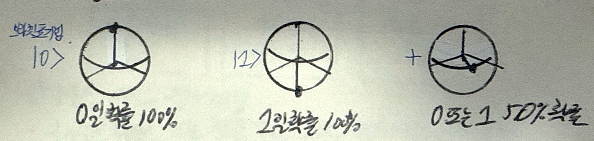
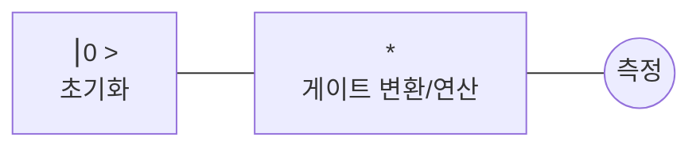

## 큐비트의 개념

- 0과 1의 상태를 동시에 갖는 양자컴퓨터의 최소 연산 단위
- 양자결맞음 상태로 존재하다 양자결잃음시 바이너리 데이터로 관측

## 큐비트의 구성도, 표기법, 계산방법

### 큐비트의 구성도

- 블로흐 구 위에 큐비트 상태 표현

### 큐비트의 표기법

| 구분 | 내용 | 비고 |
| --- | --- | --- |
| `⎮0 >` | 100% 확률로 0이 되는 상태 | 0b0과 동일 |
| `⎮1 >` | 100% 확률로 1이 되는 상태 | 0b1과 동일 |
| `+` | 0, 1이 나올 확률이 절반인 상태 | 양자 중첩 |

- 브라켓 표기법으로 큐비트 표기 가능

### 큐비트의 정보 계산 방법

- 초기화 후 큐비트의 상태를 변환하는 게이트를 거쳐서 측정

## 양자게이트 유형

| 구분 | 내용 | 비고 |
| --- | --- | --- |
| 파울리 게이트 | X, Y, Z 축 기반 비트 반전 | X, Y, Z 게이트 |
| 아다마르 게이트 | 양자중첩, 위상 회전 | H, T 게이트 |

- 파울리, 아다마르 게이트를 결합하여 반가산기에 활용
