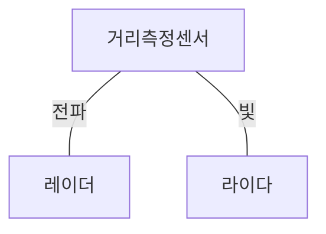
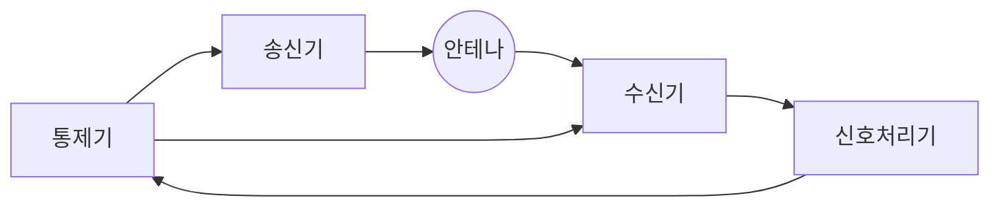
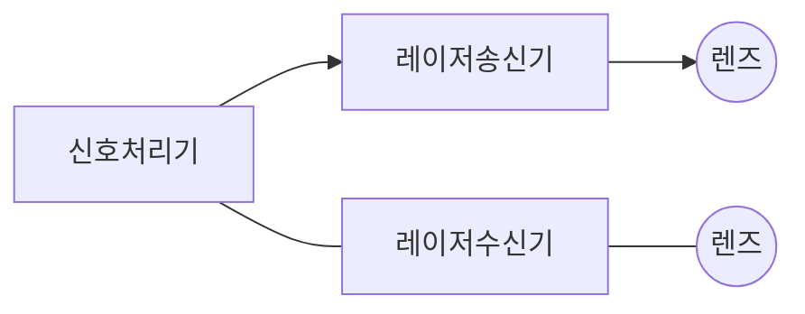

## 거리측청센서 개념

- 물체의 거리를 감지하고 측정하기 위한 장치로 레이더, 라이다, 초음파, 적외선, 카메라 사용

## 레이더, 라이다 개념도, 구성요소

### 레이더 개념도, 구성요소

- 전자기파를 방사하고 물체에 반사되는 전파를 분석하여 물체 간 거리를 측정하는 기술

| 구분 | 내용 | 비고 |
| --- | --- | --- |
| 송신기 | 고주파 전파 생성, 방사 | 레이더 성능 결졍 |
| 수신기 | 반사된 전파로 수신하여 신호 변환 | 감도, 잡음 처리 |
| 안테나 | 전파 방사, 수신 역할 | 탐지범위, 해상도 |
| 신호처리기 | 신호 분석 후 표적 정보 파악 | 디지털 신호 처리 |
| 통제기 | 레이더 시스템 동작 제어 | 운용 최적화 |

### 라이다 개념도, 구성요소

> Radio Detection and Ranging

- 레이저 빛을 발사하고 물체에 반사된 시간을 측정하여 거리, 형상, 속도 등을 측정하는 기술

| 구분 | 내용 | 비고 |
| --- | --- | --- |
| 레이저 송신기 | 레이저 생성 및 방출 | 다양한 파장 사용 |
| 레이저 수신기 | 반사된 레이저 수신, 신호 변경 | 광검출기 |
| 렌즈 광학시스템 | 빛의 방향 스캔, 수신한 빛 집중 | 회전식 렌즈 |
| 신호처리기 | 수집된 신호 분석, 정보 추출 | 디지털 신호 처리 |

### 레이더, 라이다 비교

> Light Detection and Ranging

| 구분 | 레이더 | 라이다 |
| --- | --- | --- |
| 신호 | 라디오 전파 | 레이더 |
| 거리 | 김 | 짧음 |
| 방향 | 특정방향 | 360도 |
| 장점 | 악천후에 안정적 | 높은 정확도 |
| - | 넓은 범위 탐지 | 3차원 정보 |
| 단점 | 낮은 해상도 | 악천후 취약 |
| - | 형태 파악불가 | 측정거리 제한 |
| 분야 | 항공, 해상, 군사, 자율주행 | 드론, 로봇, 자율주행 |
