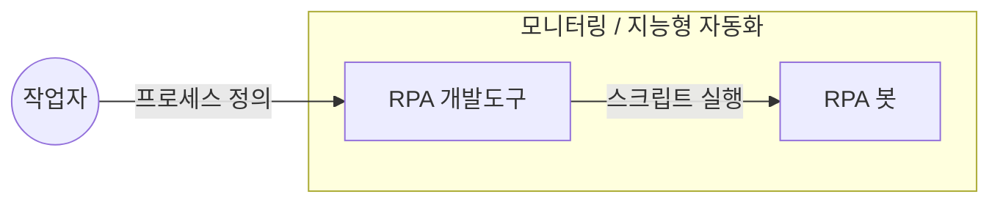

## RPA 개념

- 소프트웨어 봇을 활용하여 반복적이고 규칙적인 업무와 프로세스를 지능형 자동화 하는 기술
- 생성형 모델의 에이전트 기반으로 태스크의 완전한 자동화 가능성

## RPA 구성도, 구성요소, 적용방안

### RPA 구성도

### RPA 구성요소

| 구분 | 내용 | 비고 |
| --- | --- | --- |
| RPA 개발도구 | 프로세스 모방 스크립트 작성 | AI 모델 통합 |
| RPA 봇 | 로봇 실행, 자동화 | 데이터 수집 |
| 모니터링 | 봇 작업 모니터링, 자원 관리 | AI 모델 업데이트 |
| 지능형 자동화 | AI 기반 스크립트 자동화 | 작업자 개입 최소화 |

### RPA 적용방안

| 구분 | 내용 | 비고 |
| --- | --- | --- |
| 공공 | 데이터 입력, 문서 처리, 보고서 작성 자동화 등 행정 업무 자동화 | 효율성 증대 및 오류 감소 |
| 금융 | 대출 신청 처리, 고객 상담 자동화 등 고객 서비스 개선 | 서비스 품질 향상 및 대기 시간 감소 |
| 민간 | 재고 관리, 구매 주문 처리 자동화 등 생산성 향상 | 운영 비용 절감 및 생산성 증가 |

## RPA 고려사항

- RPA 사용방법에 대한 지속적인 업무 교육으로 러닝커브 감소 필요
- RPA 결과에 대한 검증 절차 마련 필요
