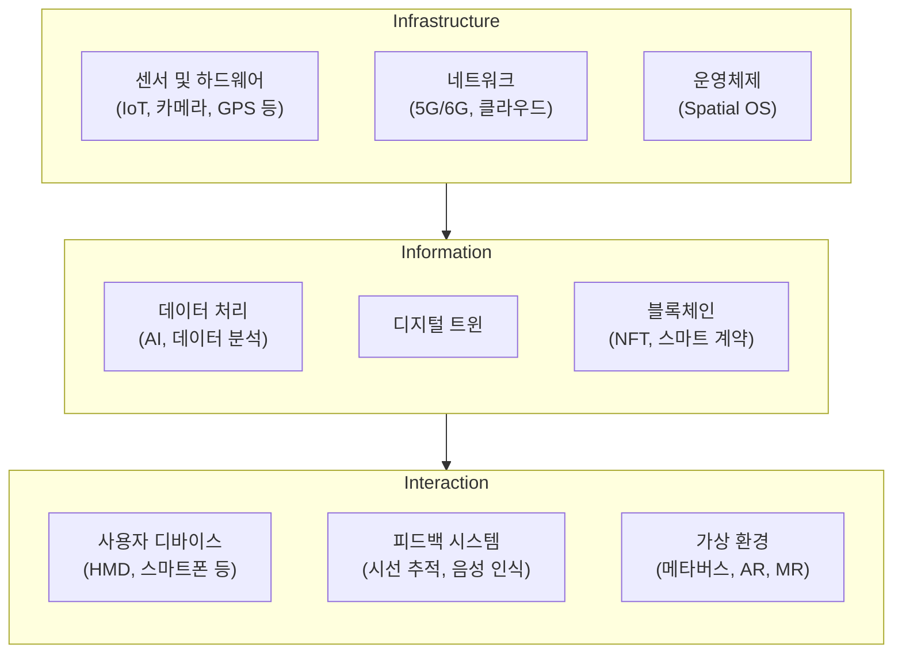

## 공간컴퓨팅 개념

- ==디지털 콘텐츠를 실제 세계에 고정==하여 물리적 세계를 증강하고, 몰입적이며 직관적인 사용자 경험을 제공하는 기술
- 증강현실(AR), 혼합현실(MR), 메타버스 기술과 네트워크, ==HMD== 등 하드웨어 기술의 융합하여 물리적 공간을 디지털로 매핑

## 공간컴퓨팅 구성도, 핵심요소, 활용분야

### 공간컴퓨팅 구성도

### 공간컴퓨팅 핵심요소

| 계층 | 핵심 요소 | 설명 |
| --- | --- | --- |
| ==인프라== 계층 | 센서 및 하드웨어 | IoT, GPS, 카메라 등 데이터 수집 장치 |
| | 네트워크 | 5G/6G 기술과 엣지-클라우드 기반 데이터 처리 |
| | 사용자 장치 | HMD 및 컨트롤러를 통한 몰입형 경험 제공 |
| ==정보== 계층 | 데이터 및 AI | 실시간 데이터 분석 및 콘텐츠 생성 |
| | 블록체인 | 신뢰성 있는 디지털 자산 관리 |
| | 디지털 트윈 | 물리적 세계의 복제 및 시뮬레이션 |
| ==상호작용== 계층 | 사용자 디바이스 | HMD, 스마트폰 등을 통한 직관적 인터페이스 |
| | 피드백 시스템 | 음성 명령, 시선 추적, 모션 센서 |
| | 가상 환경 | 메타버스, AR, MR 기반의 몰입형 디지털 공간 |

### 공간컴퓨팅 활용사례

| 구분 | 사례 | 기대 효과 |
| --- | --- | --- |
| 기업 | R&D를 위한 가상 협업 | 협업 비용 절감 및 의사결정 효율성 향상 |
| | 건설/기계/전기 프로젝트의 디지털 트윈 활용 | 설계 및 시뮬레이션으로 문제 해결 속도 증대 |
| | 직원 실습 기술 교육 | 실제 상황에 기반한 훈련으로 기술 숙련도 향상 |
| 소비자 | 가상 콘서트 및 라이브 공연 | 몰입형 엔터테인먼트 경험 제공 |
| |매장 내 가상 제품 체험 | 구매 전환율 증가 및 고객 만족도 향상 |
| | 상황 인식 방향 및 탐색 | 사용자 편의성 증대 및 경험 향상 |

## 공간컴퓨팅 도입을 위한 주요 고려사항

| 고려사항 | 문제점 | 해결방안 |
| --- | --- | --- |
| 비용 문제 | ==고가의 HMD==와 디지털화 자산 구축 비용 | 저비용 HMD 개발 및 자산 디지털화 자동화 도구 개발 |
| 기술적 제약 | HMD 무게, 배터리 한계, ==사일로형 앱 통합 문제== | 경량화된 HMD 설계 및 표준화된 통합 프로토콜 도입 |
| 보안 문제 | 데이터 ==프라이버시== 및 윤리적 이슈 | 강력한 데이터 암호화 및 디지털 윤리 규제 마련 |
| ==킬러 앱 부족== | 소비자 채택을 가속화할 결정적 사용 사례 부족 | 매력적인 엔터테인먼트 및 리테일 중심의 응용 사례 개발 |
