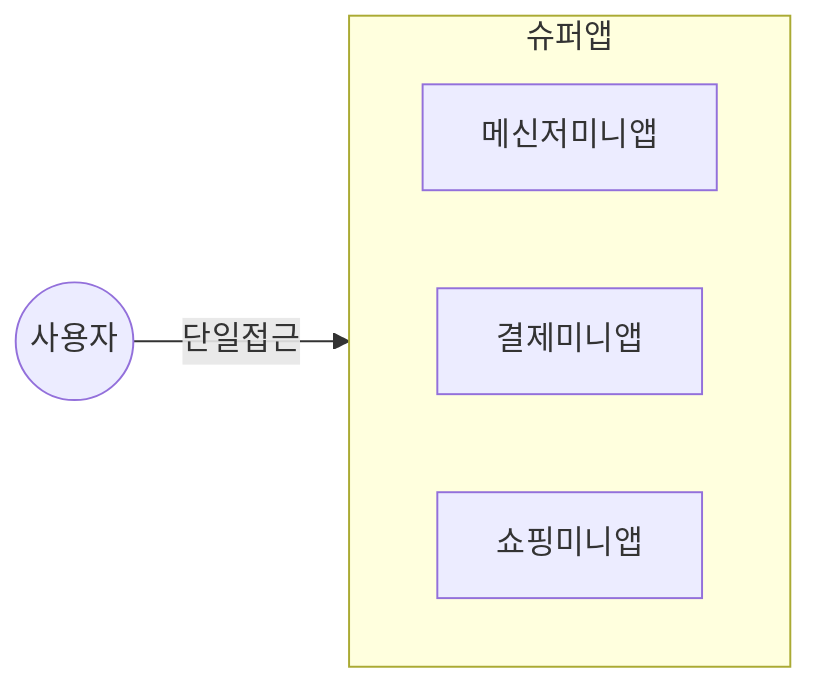
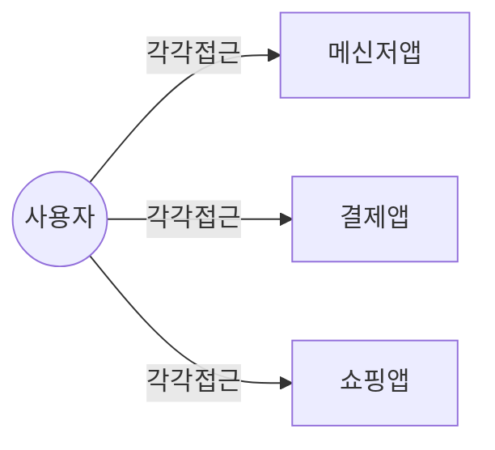

## 슈퍼앱

- 하나의 앱 안에서 다양한 서비스를 통합 제공하여 다른 앱을 설치하지 않고 여러 서비스를 이용할 수 있는 앱
- 사용편의성, 고객 락인효과, 지속적인 거래경험

## 슈퍼앱, 멀티앱 비교

### 슈퍼앱 개념

```mermaid
graph LR
  사용자((사용자)) -->|단일접근| 슈퍼앱

  subgraph 슈퍼앱
    direction LR
    메신저미니앱
    결제미니앱
    쇼핑미니앱
  end
```

- 하나의 앱 안에 다양한 미니앱 통합 제공

### 미니앱 개념

```mermaid
graph LR
  사용자((사용자)) -->|각각접근| 메신저앱
  사용자 -->|각각접근| 결제앱
  사용자 -->|각각접근| 쇼핑앱
```

- 서비스별 앱 분리 후 별도 앱으로 제공
