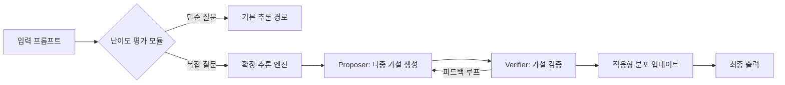

## 테스트 타임 컴퓨트 개요

### 테스트 타임 컴퓨트 개념

- 추론 단계에서 동적 계산 자원 할당을 통해 모델 성능을 최적화하는 기술
- 기존 모델 스케일링 접근법과 달리 파라미터 확장 대신 추론 시 연산량을 가변 조절함으로써, 동일 아키텍처에서도 문제 난이도에 따른 효율적 자원 관리가 가능
  - 훈련 시간 계산(Train-Time Compute) 대비 추론 단계 계산 최적화

### 테스트 타임 컴퓨트 배경

- 데이터 고갈 문제: 대규모 학습 데이터 확보의 물리적 한계
- 에너지 효율성 요구: 100B+ 파라미터 모델의 환경 부담 증가
- 엣지 컴퓨팅 수요: 모바일 기기에서의 실시간 추론 필요성
- LLM 스케일링 한계: 단순 모델 확장의 성능 한계 돌파 필요

## 테스트 타임 컴퓨트 구성도, 구성요소, 적용방안

### 테스트 타임 컴퓨트 구성도

### 테스트 타임 컴퓨트 구성요소

| 구분 | 내용 | 비고 |
| --- | --- | --- |
| 난이도 평가 모듈 | 쉬운 문제에서 최소계산, 어려운 문제에서 병렬 계산 | 최적의 답안 도출 |
| Proposer | 다중 후보 답안 생성, 가능성 탐색 | 몬테카를로 트리 탐색 |
| Verifier | 답안의 정확도, 신뢰도 평가 후 오류 최소화 | 과정 검증(PRM), 결과 검증(ORM) |
| 피드백 루프 | 오류 패턴 자가 수정 메커니즘 | 강화학습 기반 최적화 |

### 테스트 타임 컴퓨트 적용방안

| 구분 | 내용 | 비고 |
| --- | --- | --- |
| Best-of-N Sampling | N개 답안 생성 후 최상위 선택 | 계산 비용 대비 효율 균형 필요 |
| Beam Search | 상위 K개 경로 유지하며 탐색 | PRM과 결합시 성능 향상 |
| STaR 알고리즘 | 자기 주도적 추론 개선 | 실시간 지식 습득 가능 |
| 동적 컴퓨트 할당 | 문제 난이도에 자원 조정 | Easy: 1-4회, Hard: 16-256회 반복 |
| 멀티모달 통합 | 텍스트+코드+시각 데이터 협업 | HuggingFace 다중 검증기 모델 |

## 테스트 타임 컴퓨트 발전방향

- PRM(Process Reward Model) 고도화
  - 계층적 점수화(Hierarchical Scoring): 추론 단계별 가중치 차등 적용
  - 교차 검증 메커니즘: 다중 PRM 앙상블을 통한 편향 감소
- 에지 컴퓨팅 통합
  - 분산 검증 아키텍처: 모바일 디바이스-클라우드 협업
  - 양자화 기반 경량화: 8비트 PRM 모델 개발
