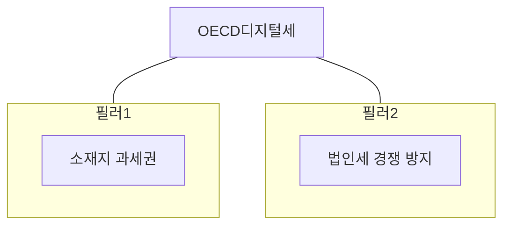

## OECD 디지털세 개념

- 글로벌 IT기업이 자국 내에서 일으킨 매출에 대해 각 국이 부과하는 법인세와 별도 세금
- 과세 형평성 제고, 안정적 세수 확보, 사업장이 없는 다국적 기업의 서비스 수익에 대한 과세

## OECD 디지털세 구성도, 구성요소, 대응방안

### OECD 디지털세 구성도

- 시장 소재지 국가에 과세권을 배분하고, 글로벌 최저한세율 도입으로 국가 간 법인 세율 경쟁 방지

### OECD 디지털세 구성요소

| 구분 | 내용 | 비고 |
| --- | --- | --- |
| 필러1 | 시장 소재지 추가 과세권 배분 | 초과이익의 일정부 과세 |
| - | 디지털 서비스 기업 대상 | 연매출 200억 이상, 이익률 10% 이상 |
| 필러2 | 글로벌 최저한 세율 15% 도입 | 법인 세율 차이 감소 |
| - | 모든 다국적 기업 대상 | 연매출 7억 5천만 유로 이상 |

### OECD 디지털세 대응방안

| 구분 | 내용 | 비고 |
| --- | --- | --- |
| 기업 | 글로벌 사업구조 재검토 | 세금 부담 최소화, 효율적 조세 전략 |
| - | 정부정책 모니터링 | 각국 디지털세 도입 현황, 규제 파악 |
| 공공 | 국제 협력 강화 | OECD, G20 국가 간 협력 통한 시행 |
| - | 국내 법, 제도 정비 | OECD 모델 규칙 반영, 국내 상황 반영 |
| 민간 | 의견 수렴, 정책 제안 | 이해관계자 의견 수렴, 반영 |
| - | 디지털세 관련 정보 제공 | 기업, 개인에게 디지털세 교육 |

## OECD 디지털세 전망

| 구분 | 내용 | 비고 |
| --- | --- | --- |
| 다자간 조약 체결 | 디지털세 규칙을 반영한 조약 체결 및 이행 | 각국 비준 절차, 국내 법제화 필요 |
| 디지털세 범위 확대 | 기업 적용 가능성 확보 | 디지털 경제 발전 따라 변동 가능 |
| 새로운 과세 모델 | 필러 1,2 외의 모델 개발 | 디지털 경제 변화에 따른 조세 제도 개편 |
