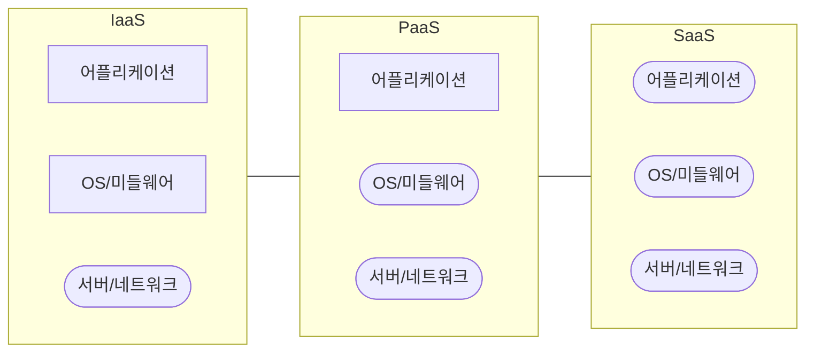

## 클라우드 서비스 유형 구성도, 구성요소

### 클라우드 서비스 유형 구성도

### 클라우드 서비스 유형 구성요소

| 구분 | 개념 | 운영책임 |
| --- | --- | --- |
| IaaS | 컴퓨팅 리소스를 서비스로 제공 | 사용자 |
| PaaS | 개발 플랫폼을 서비스로 제공 | CSP + 사용자 |
| SaaS | SW솔루션을 서비스로 제공 | CSP |

- 사용자는 시스템 요구사항과 서비스 운영 책임에 따른 클라우드 서비스 선택

## 클라우드 평가기준

### 클라우드 서비스 평가대상

- 클라우드 서비스 또는 관련 자산, 조직, 지원 서비스 모두 포함

### 클라우드 서비스 평가기준

| 구분 | 인증 | 분야 |
| --- | --- | --- |
| IaaS | IaaS 인증 | 정보보보호정책, 인적/자산 보안 등 |
| SaaS | SaaS 표준인증 | IaaS 인증보다 일부분야 간소화 |
| - | SaaS 간편인증 | 침해, 네트워크 보안 등 |
| DaaS | DaaS 인증 | 정보보호정책, 인적/자산 보안 등 |

- 복잡한 인증 절차로 인해 등급제로 전환 시행

### CSAP 등급제

| 구분 | 분야 | 비고 |
| --- | --- | --- |
| 상 | 국가이익, 민감정보, 행정 | 물리적 망분리 |
| 중 | 비공개 업무가능, 운영 | 물리적 망분리 |
| 하 | 개인정보 미포함, 공공분야 예외 | 물리, 놀리적 망분리 |

- 기존 인증은 중등급으로 일괄 적용 검토

## CSAP 인증 고려사항

- 과한 인증비용 대비 인증 사용 범위가 적으므로, 현실적인 대응 방안 마련 필요
