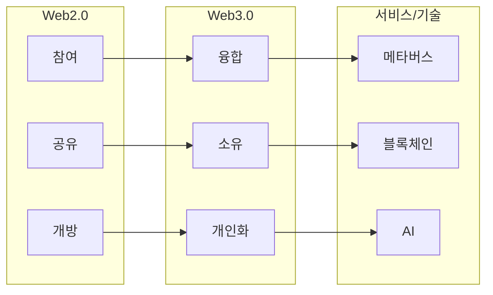

## 웹 3.0 개념

- 시멘틱 웹 기반으로 개인 맞춤 컨텐츠를 제공하고, 데이터를 소유할 수 있는 분산된 융합형 웹
- 글로벌 플랫폼 기업 데이터 집중화, 데이터 개방성 및 상호운용성 확보, 탈중앙 자율조직의 데이터 관리

## 웹 3.0 구성도, 핵심요소

### 웹 3.0 구성도

### 웹 3.0 핵심요소

| 요소 | 기술 | 비고 |
| --- | --- | --- |
| 컨텐츠 소유권 | NFT | 디지털켄텐츠 소유권 주장 가능 |
| 탈중앙화| 블록체인 | 중앙기관 없는 분산 원장 |
| 개인화서비스 | AI | 사용자 맞춤형 데이터 제공 |
| 확장된 미디어 인터페이스 | 메타버스 | 현실-가상 융합 공간 제공 |

## 웹 3.0 변화

- 탈중앙 자율조직 DAO 출현
- 블록체인과 AI로 웹 구조 혁신
- 웹 활동으로 코인, 토큰 보상

## 웹 3.0 발전 전망

| 구분 | 전망 | 비고 |
| --- | --- | --- |
| 공공 | 정부 투명성, 접근성 증대 | 디지털 행정 |
| 기업 | 비지니스모델 혁신, 데이터 주권 강화 | 탈중앙화 플랫폼 |
| 민간 | 개인 데이터 자율성 강화, 수익 창출 | 프로슈머 |

- 데이터 탈중앙화와 소유를 통해 사용자 경험 개선 및 요구 충족

## 참조

- [LG CNS: 웹3.0, 클라우드 그리고 초개인화](https://connect.lgcns.com/NC023_web3)
- [SK Hynix: AI와 데이터 개인화에 최적화된 인터넷 세상, 웹 3.0이 온다](https://news.skhynix.co.kr/post/big-tech-4-web3)
