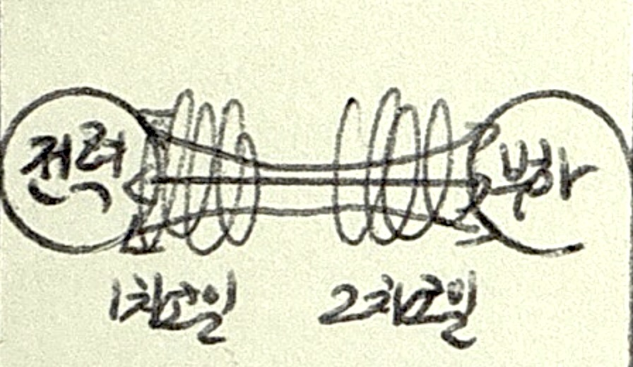
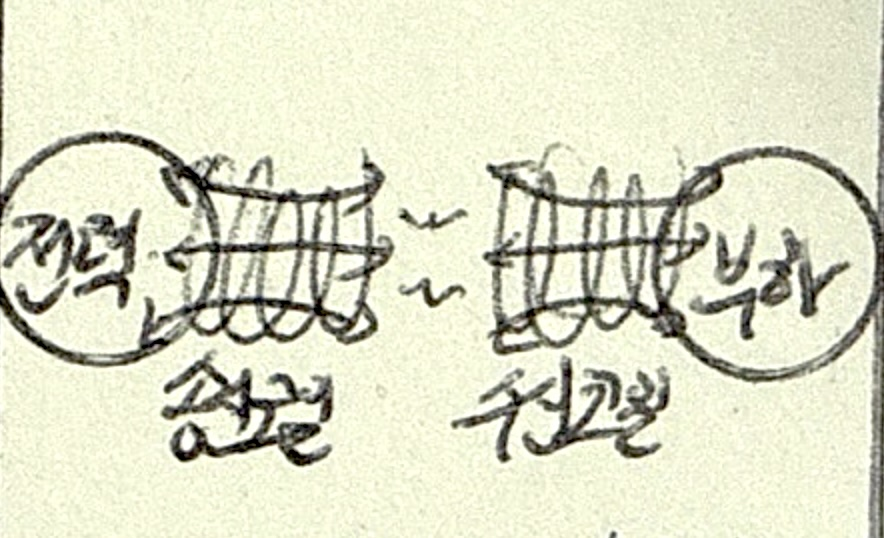
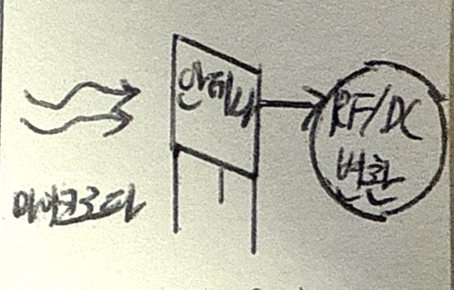

## 무선충전 기술 개념

- 전자기유도나 전자기파를 이용하여 전력을 무선으로 전송하여 배터리를 충전하는 기술
- IoT 무선충전, 자율주행차 무선 충전을 위해 중요성 대두

## 무선충전 방식 유형

### 자기유도 방식

> Inductive coupling

| 구분 | 내용 | 비고 |
| --- | --- | --- |
| 동작원리 | 1,2차 코일 간 자기유도현상을 이용 | 패러데이 법칙 |
| 특징 | 고효율, 짧은 거리, 충전패드 접촉 | 범용성 |
| 응용 | 스마트폰, 웨어러블 기기 | Qi 표준 |

### 자기공명 방식

> Resonant magnetic coupling

| 구분 | 내용 | 비고 |
| --- | --- | --- |
| 동작원리 | 송수신 코일 간의 자기장 공명 이용 | 에너지 효율성 |
| 특징 | 수m 전송 가능, 동시 충전 가능 | 공간 자유도 |
| 응용 | 전기자동차, 휴머노이드 | AirFuel 표준 |

### 전자기파 방식

> RF-based wireless power

| 구분 | 내용 | 비고 |
| --- | --- | --- |
| 동작원리 | 송신 안테나에서 전자기파 발생, 수신 안테나에서 전력 변환 | 넓은 커버리지 |
| 특징 | 매우 긴 전송거리, 장애물 투과, 저효율 | 원거리 무선충전 |
| 응용 | IoT 센서, 소형 전자기기 | Wi-charge |

## 무선충전 기술 비교

| 구분 | 자기유도 | 자기공명 | 전자기파 |
| --- | --- | --- | --- |
| 거리 | 초단거리, cm | 단거리, m | 장거리, km |
| 효율 | 높음, 70%이상 | 보통 40~60% | 낮음 1%미만 |
| 정렬 필요성 | 높음 | 낮음 | 낮음 |
| 응용분야 | 스마트폰, 웨어러블 디바이스 | 전기차, 로봇 | IoT 센서, 소형기기 |

## 무선충전 기술 고려사항

- 효율, 안전, 비용
- 폐배터리
- 충전인프라
