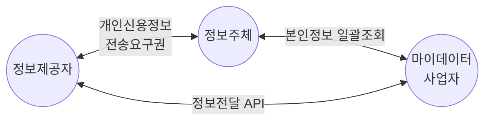

## 데이터 3법 개요

### 데이터 3법 개념

- 데이터 산업에 관련 있는 ==개인정보보호법, 정보통신망법, 신용정보법==을 말함

### 데이터 3법 개정 배경

| 구분 | 문제점 | 기대효과 |
| --- | --- | --- |
| 산업측면 | AI, 클라우드 등 신사업, 양질 데이터 부족 | 양질 데이터 확보, 법적 관리 |
| 제도측면 | 데이터 관리 법적 근거 부족 | 법, 체계, 감독기구 일원화, 개인정보 자기결정권 |

## 마이데이터 사업 개념도, 구성요소, 활용방안

### 마이데이터 사업 개념도

- 개인의 자기정보 결정권과 데이터의 활용, 통제하는 권리를 갖는 서비스

### 마이데이터 구성요소

| 구분 | 내용 | 비고 |
| --- | --- | --- |
| 정보주체 | 정보제공자에게 신용정보 전송 요구 | 금융회사 신용조회 등 |
| 정보제공자 | 인증수단활용 본인확인, 마이데이터 API 전송 | 가명처리, 암호화 |
| 마이데이터사업자 | 다수의 정보제공자로 수집된 신용정보 조회 등 기능 제공 | 보험, 금융, 신용 조회 |

### 마이데이터 활용방안

| 구분 | 제공범위 | 활용방안 |
| --- | --- | --- |
| 은행/카드 | 계좌잔액, 결제내역, 대출내역 등 | 통합자산조회 |
| 통신 | 통신료납부, 소액결제 등 | 통신료납부 신용 반영 |
| 공공 | 국세, 관세, 지방세 납부증명 등 | 납부증명 신용 반영 |

## 마이데이터 고려사항

| 구분 | 내용 | 비고 |
| --- | --- | --- |
| 관리적 | 데이터 보호 강화, 개선사항 반영 | 데이터 주권 확보 |
| 기술적 | 데이터 보안 검수, 표준화 | 보안성, 유지보수성 |
| 제도적 | 마이데이터 사업자 지원 확대 | 참여 사업자 지원 등 |
