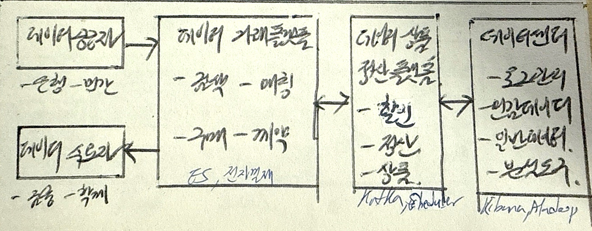

## 데이터 거래소 개념

- 데이터 수집, 가공하여 부가가치를 높혀 소비자에게 공급하는 대규모 플랫폼
- 데이터 품질보증, AI학습 데이터 마련, 데이터 활용 경제 활성화

## 데이터 거래소 구성도, 활성화 방안

### 데이터 거래소 구성도

### 데이터 거래소 활성화방안

- 데이터 바우처
- 빅데이터 캠퍼스
- VM, R, Spark 등 데이터 분석 환경 지원
