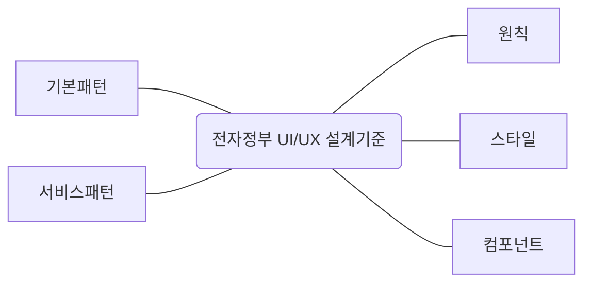

## 전자정부 UI/UX 설계기준 개념

- 전자정부 웹사이트 구축시 사용자 경험 최적화와 접근성 제고를 위해 표준화된 지침
- 사용자중심 설계, 접근성 향상, 법적요구사항 준수, 일관성 유지, 유지보수성

## 전자정부 UI/UX 설계기준 구성도, 구성요소, 적용범위 및 항목

### 전자정부 UI/UX 설계기준 구성도

- 원칙을 기반으로 스타일, 컴포넌트, 패턴을 확장하여 설계

### 전자정부 UI/UX 설계기준 구성요소

| 구분 | 내용 | 비고 |
| --- | --- | --- |
| ==원칙== | 방향성과 설꼐 기준 | 상위원칙, 준수방안 |
| ==스타일== | 컴포넌트, 패턴을 시각적 일관성을 표현하기 위한 규칙 | 시각적 경험, 규칙 기반 |
| ==컴포넌트== | UI의 기본단위로 공통 요소에 대한 가이드 | 특성, 역할, 유형, 용례 |
| ==기본패턴== | 컴포넌트의 조합으로 사용되는 UI 집합 | 공통 과업 패턴 |
| ==서비스패턴== | 사용자 여정 기반 UX 설계 가이드 | 필수, 권장, 우수 단계 |

## 전자정부 UI/UX 설계기준 적용범위 및 항목

| 구분 | 적용범위 | 항목 |
| --- | --- | --- |
| 중앙행정기관 | 정부로고, 독자로고 사용 중앙행정기관 어플리케이션 | 공식 배너, 헤더, 푸터 |
| 공공기관 | 공공기관 대표 운영 어플리케이션 | 헤더, 푸터 |
| 지방자치단체 | 지방자치단게 운영 어플리케이션 | 공식 배너, 헤더, 푸터 |

- UI/UX 스타일 가이드와 컴포넌트 패턴 가이드를 모두 준수 필요

## 전자정부 UI/UX 가이드라인 활용방안

| 구분 | 내용 | 비고 |
| --- | --- | --- |
| 요구사항 정의 | 프로젝트 초기 요구사항에 설계기준 포함 | 명확한 목표 설정 |
| 설계 및 개발 | 설계 기준과 가이드라인 참고 UI/UX 설계, 개발 | 일관된 디자인 보장 |
| 테스트 | 품질 점검표 사용 UI/UX 품질 검사 | 오류/개선점 식별 |
| 유지보수 | 정기적 UI/UX 평가 및 개선 | 지속적 사용자 만족도유지 |
