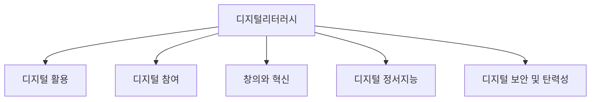

## 디지털 리터러시의 개념

- 디지털 기술 및 도구를 활용하여 정보를 탐색, 비판적으로 평가, 분석, 활용할 수 있는 능력과 디지털 환경에서 정보를 효과적으로 활용, 생산, 윤리적 책임감을 가지고 타인과 소통하는 역량을 포괄함.
- 정보 과잉 시대에 정보 탐색 및 비판적 사고 능력 향상과 디지털 시민 의식 함양을 위해 필요.

## 디지털 리터러시의 개념도, 구성요소, 교육방안

### 디지털 리터러시의 개념도

### 디지털 리터러시의 구성요소

| 구분                  | 내용                                         | 비고                                   |
| --------------------- | -------------------------------------------- | -------------------------------------- |
| 디지털 활용           | 효과적인 정보 활용을 위한 기본적인 역량      | 정보 탐색, 평가, 분석 관리 능력        |
| 디지털 참여           | 디지털 환경에서 소통하고 참여하는 역량       | 정보 공유, 협업, 네트워킹, 표현 능력   |
| 창의와 혁신           | 디지털 기술을 활용한 창의적 문제 해결 역량   | 정보 창작, 콘텐츠 제작, 문제 해결 능력 |
| 디지털 정서지능       | 디지털 환경에서 건강한 관계 형성을 위한 역량 | 온라인 공감, 자기 표현, 관계 형성 능력 |
| 디지털 보안 및 탄력성 | 안전하고 책임감 있는 디지털 시민 의식        | 정보 보안, 윤리 의식, 사이버 탄력성    |

### 디지털 리터러시의 교육방안

| 구분 | 내용                                                                  | 비고                      |
| ---- | --------------------------------------------------------------------- | ------------------------- |
| 공공 | 정규 교육과정에 디지털 리터러시 교육 포함하여 체계적으로 교육 제공    | 정보 교육 강화, 교사 연수 |
| 기업 | 직원들의 디지털 역량 강화를 위한 사내 교육 프로그램 운영              | 업무 효율성 향상          |
| 민간 | MOOC 등 온라인 강좌를 통하여 시공간 제약없는 디지털리터러시 교육 제공 | 정보격차 해소             |

## 디지털 리터러시 고려사항

- 디지털 역기능 문제를 줄이고 건전한 디지털 문화 조성을 위해 정보 윤리 교육을 강화해야함.
