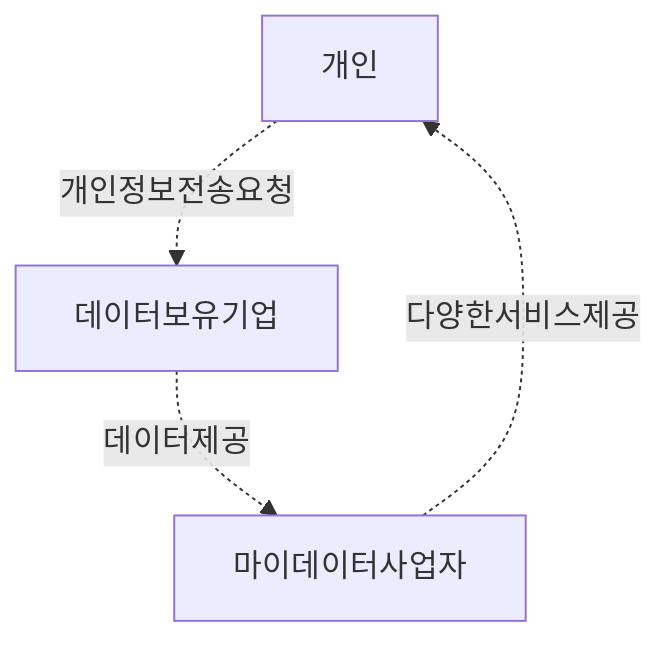

## I. 마이데이터의 개요

### 가. 개념

개인정보 전송요구권을 통해 내 데이터를 능동적으로 관리하고 활용하는 서비스

### 나. 목적

마이데이터 사업자의 수익창출, 고객 락킹, 빅데이터 수집 및 맞춤형 추천 서비스 제공을 위해 필요.

## II. 제공범위 및 활성화 방안

### 가. 제공 범위

| 산업     | 제공범위                      |
| -------- | ----------------------------- |
| 은행     | 거래내역, 대출내역 등         |
| 보험     | 주계약, 보험료 납입내역 등    |
| 금융투자 | 주식 보유수량 등              |
| 카드     | 결제내역, 포인트 등           |
| 통신     | 통신료 납부, 소액 결제내역 등 |
| 공공     | 세금 납입 증명 등             |

### 나. 활성화 방안

| 구분   | 내용                                                    | 비고 |
| ------ | ------------------------------------------------------- | ---- |
| 제도적 | 산업 확대 가이드 구성 마이데이터 사업자 지원 확대   | -    |
| 기술적 | 데이터 전산화, 표준화 보안 기술 연구 지원           | -    |
| 관리적 | 데이터 주권 홍보 강화 기존 사업자들의 개선 사항반영 | -    |

사업자 불신, 정보제공 거부감, 사용자 인식부족 등을 저해요인을 없애기 위해 서비스 신뢰성 확보 및 홍보 필요.

## 기출

- 128/2/4
