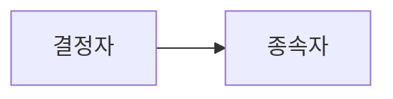

## 정규화의 개념

- 이상현상을 야기하는 속성 간의 종속관계를 제거하기 위해 릴레이션을 여러 작은 릴레이션으로 무손실분해하는 과정
- 이상현상제거, 안정성확보, 자료 불일치성 최소화, 중복제거로 인한 저장공간 효율화

## 정규화의 절차, 함수종속성, 이상현상

### 정규화의 절차

| 구분       | 절차                                 | 비고                                       |
| ---------- | ------------------------------------ | ------------------------------------------ |
| 제1정규형  | 원자값이 아닌 도메인 분해            | 데이터 중복 높음 / Join 적음 / 결합성 낮음 |
| 제2정규형  | 부분함수 종속성 제거                 | -                                          |
| 제3정규형  | 이행함수 종속성 제거                 | -                                          |
| BCNF정규형 | 결정자가 후보키가 아닌 함수종속 제거 | -                                          |
| 제4정규형  | 다중값 종속성 제거                   | -                                          |
| 제5정규형  | 조인 종속성 제거                     | 데이터 중복 낮음 / Join 많음 / 결합성 높음 |

- 무손실 분해와 하수적 종속성 제거를 통한 이상현상 제거

### 함수 종속성

- 데이터들이 어떠한 기준 값에 의해 항상 종속되는 현상
- 종속자는 결정자에 하수적 종속성을 가짐, X->Y

## 이상현상 개념, 유형

### 이상현상의 개념

- 릴레이션의 데이터 중복관리로 인해 데이터 조작시 발생하는 의도치 않은 결과를 초래하는 비합리적 현상

### 이상현상의 유형

| 구분     | 내용                                                           | Anomaly   |
| -------- | -------------------------------------------------------------- | --------- |
| 삽입이상 | 릴렐이션 내 하나의 튜플 삽입시 원하지 않은 추가 데이터 삽입    | Insertion |
| 삭제이상 | 릴레이션 내 하나의 튜플 삭제시 유지되어야할 정보까지 연쇄 삭제 | Deletion  |
| 갱신이상 | 중복 튜플 중 일부를 업데이트할 때 정보의 모순성 발생           | Update    |

## 정규화시 고려사항

- 정규화 진행시 테이블과 Join 수가 많아지므로, DX(개발자 경험) 향상을 위해 역정규화 과정도 필요함.
