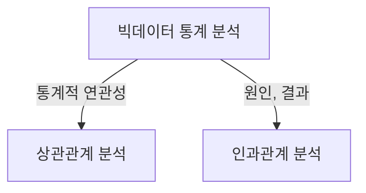
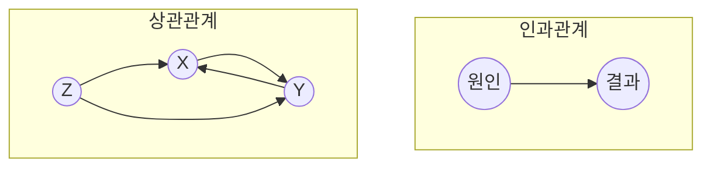

## 빅데이터 분석의 개념

- 대량의 정형, 비정형 데이터를 분석하여 의미있는 정보와 패턴을 추출하고, 의사결정에 활용하는 과정

## 상관관계, 인과관계의 개념도, 구성요소, 적용방안

### 상관관계, 인과관계 개념도

- 인과관계: 독립변인이 종속변인에 영향을 미치는지 둘 간의 관계성 분석
- 상관관계: 서열척도, 비율척도, 등간척도로 측정된 변수 간 관련성 분석

### 상관관계, 인과관계 구성요소

| 구분     | 상관관계                   | 인과관계                |
| -------- | -------------------------- | ----------------------- |
| 분석목적 | 파생, 의존관계 분석        | 원인, 결과 관계 분석    |
| 분석방법 | 상관분석, 회귀분석, 산점도 | 인과실험, 회귀분석      |
| 특징     | 양, 음, 무상관 관계        | 인과성, 시간적 선후관계 |
| 관계     | 상호의존성, 상호관계성     | 원인과 결과             |

- 상관관계는 인과관계의 필요조건이나 충분조건은 아님

### 상관관계, 인과관계 적용방안

| 구분   | 상관관계                     | 인과관계             |
| ------ | ---------------------------- | -------------------- |
| 개발   | 코드복잡도와 버그발생률      | 새 방법론 도입 효과  |
| -      | 개발기간과 기능완성도        | 코드리뷰 효과        |
| 디자인 | UI/UX 사용자 만족도와 디자인 | UI/UX 개선 효과      |
| -      | 페이지 레이아웃과 CTR        | 디자인요소 변경 효과 |
| 마케팅 | 캠페인 유형과 매출           | 마케팅 캠페인 효과   |
| -      | SNS활동과 브랜드 인지도      | 가격 할인 효과       |
