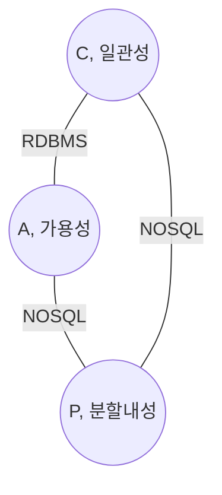
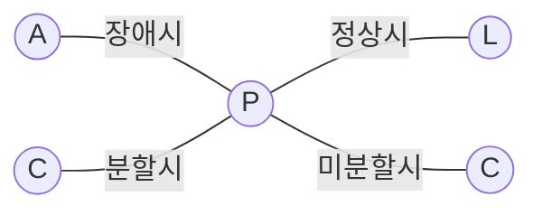

## CAP 이론 개념

- 분산시스템이 동시에 일관성, 가용성, 분할내성을 모두 만족시킬 수 없다는 이론
- 분산시스템의 특성을 이해하고 Trade-Off를 고려한 시스템 설계 가이드라인 제공 / 현실적 제약 반영 / 비지니스 요구 충족

## CAP 이론 개념도, 구성요소, 발전방향

### CAP 이론 개념도

### CAP 이론 구성요소

| 구분 | 내용 | 비고 |
| --- | --- | --- |
| ==C + P== | 일부 노드 장애시에도 일관성 유지 | MongoDB, 금융시스템 |
| ==A + P== | 일부 노드 장애시에도 시스템은 계속 응답 | DynamoDB, DNS시스템, SNS |
| ==C + A== | 네트워크 분할이 없을시 일관성, 가용성 보장 | RDBMS, 단일 노드기반 DB |

### CAP 이론 발전방향

| 한계점 | 내용 | 발전방향 |
| --- | --- | --- |
| PACELC 확장 필요 | CAP 이론은 네트워크 지연(Latency)과 데이터 복제 등을 반영하지 않음 | PACELC 이론 도입으로 Latency와 Consistency 균형 고려 |
| 다중 레벨 일관성 | 모든 시스템에서 강력한 일관성을 요구하지 않는 경우 | Eventual Consistency 모델 활용 |
| 동적 트레이드오프 | 정적 선택보다는 동적 조정이 필요한 경우 | AI 기반 동적 트레이드오프 관리 기술 개발 |

## PACELC 이론 개념도, 구성요소

### PACELC 이론 개념도

- ==CAP이론을 보완==하여 ==네트워크 분할 여부==나 정상 작동 여부에 따라 ==지연시간과 일관성의 Trade-Off==를 고려한 이론

### PACELC 이론 구성요소

| 구분 | 내용 | 비고 |
| --- | --- | --- |
| ==PA/EL== | 장애시 가용성, 정상시 지연시간 우선 고려 | DynamoDB, Cassandra |
| ==PA/EC== | 장애시 가용성, 정상시 일관성 보장 | MongoDB |
| ==PC/EL== | 장애시 일관성, 정상시 지연시간 우선 고려 | PNUT, CosmosDB |
| ==PC/EC== | 장애시 일관성, 정상시 일관성 보장 | HBase |

## NoSQL 데이터베이스 도입시 고려사항

- MongoDB 등 NOSQL의 오픈소스 라이센스가 SSPL로 이동함에 따라 CSP 서비스 개발시 Fork 버전 사용 등 대안 마련
