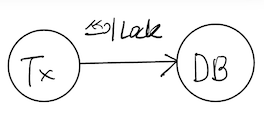
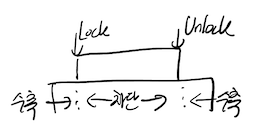
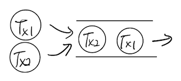

## 병행제어의 개념

- 다수의 트랜잭션이 동일한 데이터에 ==동시에 접근==하고자할 때, 각 ==트랜잭션이 독립적으로 수행된 결과를 보장==하는 기법
- 갱신손실, 연쇄복귀, 모순성 제거, 무결성 일관성 보장

## 병행제어 미수행시 문제점과 해결기법

### 병행제어 미수행시 문제점

| 문제 | 내용 | 비고 |
| --- | --- | --- |
| ==갱실분실== | 트랜잭션의 동일 데이터 동시 갱신시 발생 | 고립성 위배 |
| ==불일치== | 다중 사용자 트랜잭션들이 동시 실행시 모순된 결과 반환 | 일관성, 고립성 위배 |
| ==연쇄복귀== | 한 트랜잭션이 실패 후 롤백될 때 다른 트랜잭션 처리 취소 불가 | 일관성, 원자성 위배 |

### 병행제어 해결기법

> 그림 표현

| 구분 | 개념도 | 내용 | 비고 |
| --- | --- | --- | --- |
| ==Locking== |  |트랜잭션 사용 자원에 대해 상호배제 기능 제공 | DB락, Table락, Row락, Column락 |
| ==2PL== |  | 모든 트랜잭션의 lock과 unlock 연산을 확장, 수축단계로 구분하여 수행 | 직렬가능성 보장, 교착상태 예방필요 |
| ==Timestamp== |  | 트랜잭션 입력시 Timestamp 시간 순으로 직렬화 | 직렬가능성 보장, 교착상태 방지 |
| ==낙관적 기법== |  | 트랜잭션 수행시 미검사, 트랜잭션 종료 전 위반 검사 | Read, Validate, Write 단계 |
| ==다중버전 병행제어== |  | 여러 버전 저장 후 일관성이 보장된 트랜잭션 선택 | 동시성 우수, I/O오버헤드 증가 |

## 병행제어 고려사항

- 분산 데이터베이스 시스템의 경우, NW 지연, 노드 장애 등 문제 발생을 대비하기 위해 2PL 기법 사용
