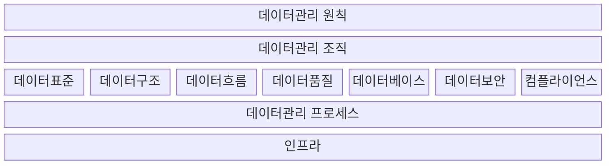

## 데이터 거버넌스의 개념

- 데이터 생성, 저장, 공유, 사용, 보관, 삭제 방법에 적용되는 내부 데이터 표준과 정책, 관리 프로세스를 설정하는 전사 데이터 통치체계

## 데이터 거버넌스 개념도, 구성요소, 적용방안

### 데이터 거버넌스 개념도

> 표구흐품베보컴

### 데이터 거버넌스 구성요소

| 구분     | 내용                                | 비고                                   |
| -------- | ----------------------------------- | -------------------------------------- |
| ==원칙==     | 데이터 유지관리 위한 지침 및 가이드 | 보안 품질 기준, 변경관리               |
| ==조직==     | 데이터를 관리할 조직의 역할과 책임  | 데이터 관리자, 소유자, 데이터 아키텍트 |
| ==프로세스== | 데이터 관리를 위한 활동과 체계      | 작업절차 모니터링, 활용관리            |

### 데이터 거버넌스 적용방안

| 구분 | 내용                          | 비고                             |
| ---- | ----------------------------- | -------------------------------- |
| CDO  | 데이터거버넌스 전략수립, 실행 | 조직문화 조성                    |
| -    | 데이터거버넌스 성과측정, 개선 | 성과지표 설정, 주기적 측정       |
| DA   | 데이터 구조관리               | 데이터 표준, 모델 설계 관리      |
| -    | 데이터 품질관리               | 메타데이터 관리, 데이터 정제     |
| DBA  | 데이터 접근통제 관리          | 데이터 오남용 방지               |
| -    | 데이터 변경이력 관리          | 데이터흐름 추적, 무결성 보장     |
| User | 데이터 활용, 가치 창출        | 데이터 분석, 활용, 의사결정 지원 |
| -    | 데이터 보안 준수              | 데이터 보안 정책 준수            |

## 데이터 거버넌스 성숙 단계

| 단계  | 구분       | 내용                                       |
| ----- | ---------- | ------------------------------------------ |
| 5단계 | 가치창출   | AI, 빅데이터 기반 신규가치 창출            |
| 4단계 | 위험대응   | 정량화된 품질관리, 사전 위험 대응          |
| 3단계 | 통합경영   | 데이터 품질관리, 의사결정 체계 도입        |
| 2단계 | 프로세스화 | 표준화된 데이터 프로세스 구축              |
| 1단계 | 도입       | 데이터 거버넌스 필요성 인식, 기본정책 수립 |
