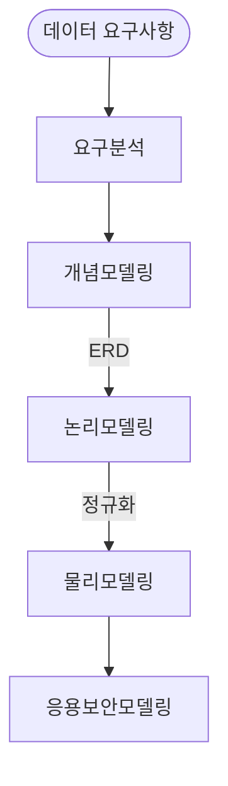
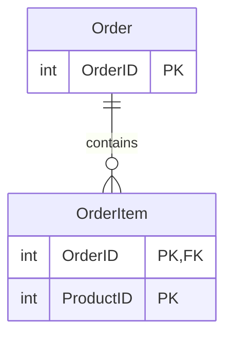
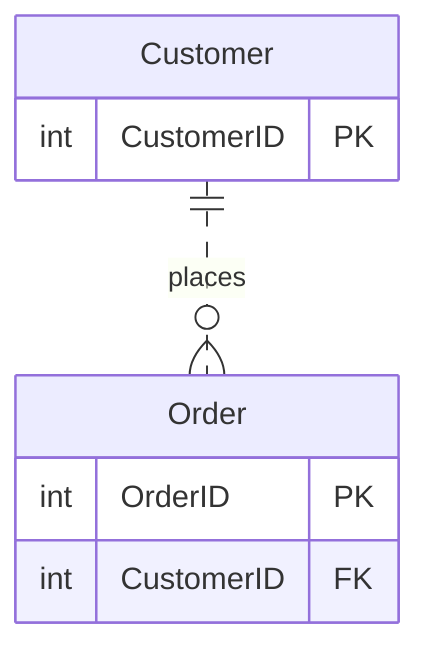

## 데이터 모델링 개념

- 현실 세계 업무 프로세스를 추상화하여 물리적으로 데이터베이스화하기 위한 과정으로, 실체와 관계 중심으로 데이터 모형을 표현하는 모델링
- 가시화, 명세화, 문서화, 추상화, 통합성, 이해성

## 데이터 모델링 단계, 식별/비식별 관계 비교

### 데이터 모델링 단계

| 단계 | 설명 | 산출물 |
| --- | --- | --- |
| 개념 모델링 | 요구사항을 데이터 모델로 변환 | ERD |
| | 엔티티와 속성 정의, 엔티티 간 식별/비식별 관계 설정 | 개념 스키마 |
| 논리 모델링 | 개념스키마를 실제 DBMS 스키마로 변환 | 논리 스키마 |
| | 데이터 구조와 무결성 제약 설정 | 테이블 정의서 |
| | 식별/비식별 관례를 기본키, 외래키로 추가 | |
| 물리 모델링 | 저장구조, 저장방법 기술, 성능 기준 충족 | 접근 권한 매트릭스 |

### 식별/비식별 관계 개념 비교

#### 식별 관계

- 하위 엔티티의 PK 구성이 상위 엔티티의 PK에 포함되는 관계

#### 비식별 관계

- 하위 엔티티의 일반 속성에 상위 엔티티의 PK가 포함되는 관계

### 식별/비식별 관계 상세 비교

| 구분 | 식별 관계 | 비식별 관계 |
| --- | --- | --- |
| 결합도 | 강한 연결관계 | 약한 연결관계 |
| 표기법 | 실선 표현 | 점선 표현 |
| PK | 하위 엔티티 PK 구성 포함 | 미포함 |
| 관계 | 자식 엔티티가 부모에 종속적 | 자식 엔티티가 부모에 독립적 |
| 데이터 무결성 | 부모 엔티티 삭제시 자식 엔티티 함께 삭제 | 부모 엔티티 삭제시 자식 엔티티 유지, 관계 해제 |
| 예시 | Order 와 OrderItem | Customer 와 Order |

## 데이터 모델링시 고려사항

### 비지니스 측면

- 비지니스 요구사항
- 엔티티 속성 정의
- 관계 설정: 엔티티 관계, 키 설정
- 무결성 제약조건: 개체, 참조, 속성 무결성

### 기술 측면

- 성능: 정규화, 반정규화, 인덱싱, 연결함정, 파티셔닝
- 용량관리: 데이터 양, 저장소, 확장성
