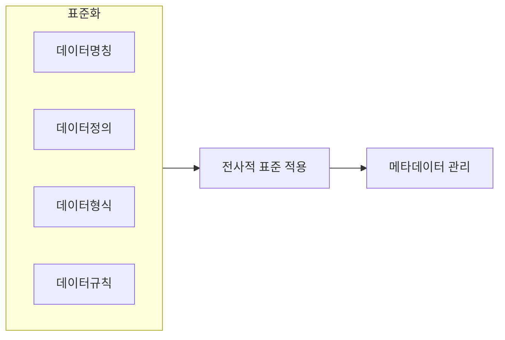

## 데이터 표준화의 개념

- ==시스템별로 산재된 데이터, 정보에 대한 명칭, 정의, 형식, 규칙에 대한 원칙을 수립==하여 이를 전사적으로 적용하는 활동
- 데이터 불일치, ==적시성 결여==, 데이터 통합의 어려움, 변경 및 유지보수 어려움, MSA 전환으로 불일치 가속화

## 데이터 표준화의 개념도, 상세설명, 적용방안

### 데이터 표준화의 개념도

- 한글명, 영문명, 영문약어명, 타입, 길이, 소수점절삭길이 등 표준화 ==메타데이터 관리==

### 데이터 표준화 상세설명

| 구분       | 내용                                                         | 비고                                     |
| ---------- | ------------------------------------------------------------ | ---------------------------------------- |
| 데이터==명칭== | 기업 내 데이터를 유일하게 구분해주는 이름                    | 유일성, 업무관점 보편성, 의미전달 충분성 |
| 데이터==정의== | 데이터가 의미하는 범위 및 자격조건                           | 제3자 관점 명명, 약어와 전문용어 지양    |
| 데이터==형식== | 데이터 표현형태 정의를 통해 데이터 입력오류, 통제위험 최소화 | 길이제한, 동질 데이터형식 통일           |
| 데이터==규칙== | 발생가능한 데이터 값 사전 통제, 무결성 확보                  | 기본값, 허용값, 허용범위                 |

### 데이터 표준화 적용방안

| 구분                        | 방안                                                          | 비고                                         |
| --------------------------- | ------------------------------------------------------------- | -------------------------------------------- |
| 데이터 표준화 요구사항 수집 | 현업부서 인터뷰, 설문조사, 표준화 현황 진단                   | 데이터현황 파악, 데이터 표준화 우선순위 결정 |
| 데이터 표준 정의            | 데이터 ==표준 용어사전 구축==, 데이터 ==표준 메타데이터 정의==        | 사내, 국내외 표준 참고, 모델링 도구 사용     |
| 데이터 표준 확정            | 데이터 표준 검토, 승인, 데이터 표준 확정, 공표                | 승인 절차 수립, 배포 계획 수립               |
| 데이터 표준 관리            | 데이터 표준 변경관리 절차수립, 데이터 표준 준수 여부 모니터링 | 관리조직 운영, 관리시스템 구축               |

## 데이터 표준화 기대효과

| 구분     | 기대효과           | 비고                                 |
| -------- | ------------------ | ------------------------------------ |
| 품질측면 | 데이터 일관성 확보 | 데이터 분석, 의사결정 지원           |
| -        | 데이터 품질 향상   | 불일치 감소, 신뢰성 확보             |
| 연계측면 | 데이터 통합 용이성 | 프로세스 표준화                      |
| -        | 상호 운용성 향상   | 업계 표준 준수, 타조직과의 협업 용이 |
| 기업측면 | 비용절감           | 데이터 관리, 유지보수 비용 절감      |
| -        | 기업전략강화       | 데이터 마트 도입, 기업경쟁력 강화    |
