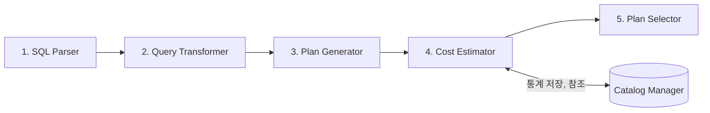

## 옵티마이저 개념

- DBMS 내에서 SQL ==쿼리 실행 계획을 분석==하고 ==최적의 계획을 수립==하는 ==핵심 엔진==
- 최적화된 쿼리 실행으로 시스템 자원의 효율적 사용과 응답시간 단축

## 옵티마이저 구성도, 구성요소, RBO, CBO

### 옵티마이저 구성도

### 옵티마이저 구성요소

| 구분 | 내용 | 비고 |
| --- | --- | --- |
| 1. SQL Parser | 쿼리파싱, 구문분석, 구문트리생성 | 문법 검사 |
| 2. Query Transformer | 쿼리 변환 하의 최적화 가능성 제고 | 쿼리 재작성 |
| 3. Plan Generator | ㅇ여러 가능한 실행 계획 생성 | 조인, 인덱스 경로 |
| 4. Cost Estimator | 각 실행 계획 예상 비용 계산 | 통계 저장, 참조 |
| 5. Plan Selector | 가장 낮은 비용 실행 계획 선택, 실행 | RBO, CBO 방식 |

### RBO, CBO 비교

| 구분 | RBO | CBO |
| --- | --- | --- |
| 최적화 기준 | 고정된 규칙 사용 | 실행 비용 추정 |
| 결정자 | 인덱스 구조, 연산자, 조건 등 | 레코드 블록 수, 평균 행 길이, 인덱스 높이, 컬럼 수 분포, 디스크 I/O |
| 특징 | 실행 계획 예측 용이 | 저장된 통계 정보 활용 |
| 장점 | 규칙 단순, 빠른 최적화 | 더 효율적인 실행 계획 수립 |
| 단점 | 복잡한 쿼리 최적화 어려움, 규칙 관리 필요 | 통계 정보 부정확할시 오류 발생 |

- 최신 DBMS는 CBO 방식 채택

## 옵티마이저 적용방안

| 구분 | 방안 | 비고 |
| --- | --- | --- |
| DA | 모델링시 인덱스 전략 설계, 파티셔닝 고려 | 효율적 구조 설계 |
| DBA | 통계정보 수립 및 갱신, 실행계획 최적화 | 모너티링, 대응 |
| User | 쵲거화된 쿼리 작성, 인덱스 힌트 사용 | 개발단계 쿼리 최적화, EXPLAIN PLAN |

## 옵티마이저 고려사항

- 개발자가 쿼리에 EXPLAIN PLAN을 사용하여 분석 후 최적화된 쿼리 구현 필요
