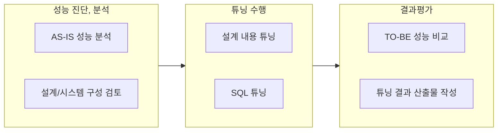

## 데이터베이스 튜닝 개념

- 응용프로그램, DB, 운영체제 등을 조정하여 한정된 자원으로 최적의 성능을 얻도록하는 개선 작업
- 처리능력증대, 처리시간단축, 응답시간단축, DB로드시간단축

## 데이터베이스 튜닝 절차, 튜닝 기법

### 데이터베이스 튜닝 절차

### 설계단계 튜닝 기법

| 구분 | 내용 | 비고 |
| --- | --- | --- |
| 정규화 | 데이터 중복 제거, 함수종속성 제거 | 무결성 확보 |
| 반정규화 | 성능 향상을 위한 중복 허용 | 조회 성능 개선 |
| 파티셔닝 | 대용량 데이블 분할 관리 | 관리효율, 조회성능 |
| 인덱스 설계 | 데이터 접근, 스캔 경로 최적화 | CBO, RBO |
| 인덱스 지정 | PK, FK 지정 | 조회, 수정 성능 개선 |

### SQL 튜닝 기법

| 구분 | 내용 | 비고 |
| --- | --- | --- |
| 쿼리재작성 | 불필요 연산 제거, 분리 | 실행계획 분석 |
| 조인방식변경 | 조인방식, 순서 변경 | 조인 유형 고려 |
| 인덱스 활용 | 적절한 인덱스 사용 | 제약조건 확인 |
| 힌트 사용 | 최적 실행 계획 제어 | 옵티마이저 제어 |

## 힌트 개념 및 유형

### 힌트 개념

- SQL문에 주석형태로 옵티마이저에게 실행계획을 지시하는 구문
- 옵티마이저의 기본 실행 계획이 최적이 아닐 경우, 성능 개선 가능

### 힌트 유형

| 구분 | 내용 | 비고 |
| --- | --- | --- |
| Scan 힌트 | 효율적인 데이터 접근방식 선택 | 테이블 또는 인덱스 |
| Join 힌트 | 효율적인 조인 방식 선택 | 특정 조인 방식 지정 |
| Leading 힌트 | 실행 계획의 조인 순서 제어 | 조인순서 지정 |
| Set 힌트 | 워크로드나 특정 쿼리에 최적화된 파라미터 선택 | 쿼리 변수 오버라이딩 |

## 데이터베이스 튜닝시 고려사항

- 튜닝 전,후 성능 변화를 지속적으로 모니터링하고 필요시 추가 튜닝 (시스템 등) 수행
