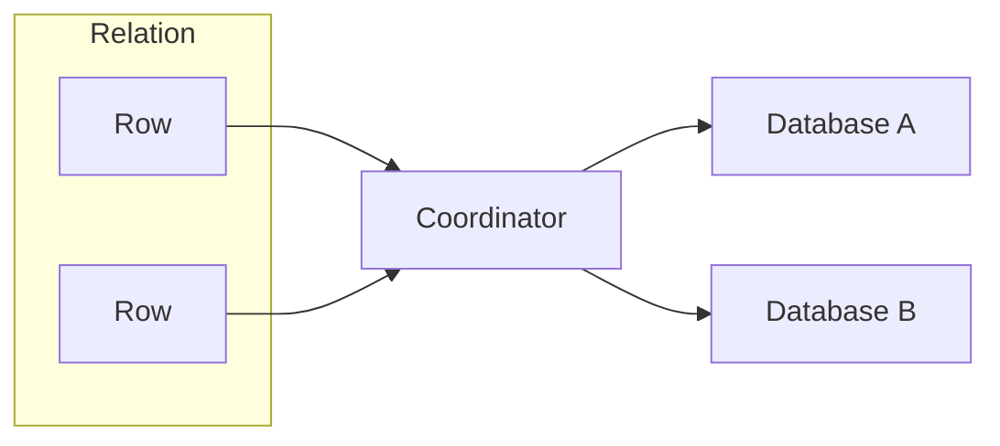
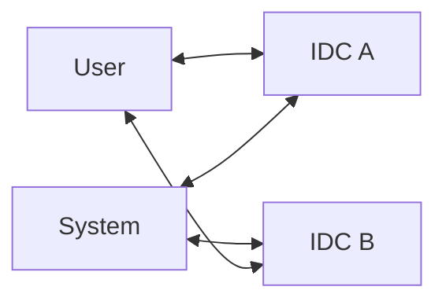
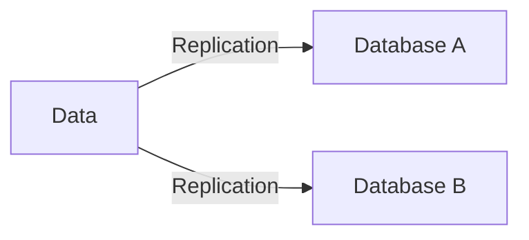
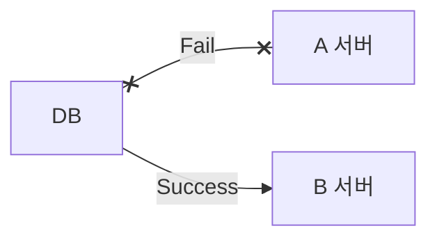
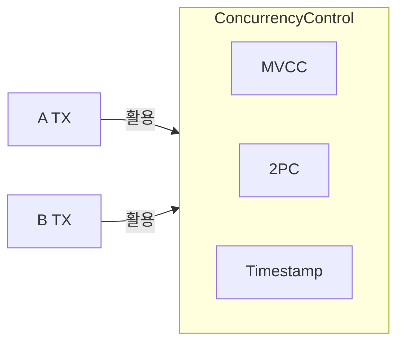

## 분산 데이터베이스 개념

- 네트워크를 통해 물리적으로 분산되어 있는 여러 개의 데이터베이스 시스템을 논리적으로 연관시킨 통합 데이터베이스
- 중복성, 지역독립성, 투명성

## 분산 데이터베이스 5가지 투명성

> 분위지중장병
> 분위복장병

### 분할 투명성

- 하나의 논리적 릴레이션에 단편들로 분할된 데이터가 여러 사이트에 저장
- Bottleneck 방지, 설계 기술 필요

### 위치 투명성

- 사용자나 프로그램이 데이터베이스의 물리적 위치를 알 필요 없이 데이터 접근 가능
- 분산 데이터 딕셔너리, 디렉토리 관리 필요

### 복제 투명성

- 접근할 데이터가 물리적으로 여러 사이트에 복제되었는지 알 필요가 없는 특성
- 점진적 일관성 유지, 전파 갱신 처리 부하

### 장애 투명성

- 지역 시스템, 통신에 장애가 있어도 데이터 무결성을 보존하는 성질
- 2 Phase Commit 활용, 장애 원인 규명 복잡

### 병행 투명성

- 다수 트랜잭션 동시 수행시 결과에 이상이 발생하지 않는 성질
- 리소스 사용 극대화, 병행 제어 활용

## CAP 이론과 분산 투명성의 관계

| 구분 | 내용 | 관계 |
| --- | --- | --- |
| Consistency | 데이터 일관성 보장 | 병행투명성, 복제투명성 |
| | | 네트워크 분할시 가용성 희생 |
| Availability | 요청에 항상 응답 | 분할투명성, 장애투명성 |
| | | 네트워크 분할시 일관성 희생 |
| Partition Tolerance | 네트워크 분할시 시스템 동작 유지 | 장애투명성 |
| | | 네트워크 분할시 C 또는 A 선택 |
