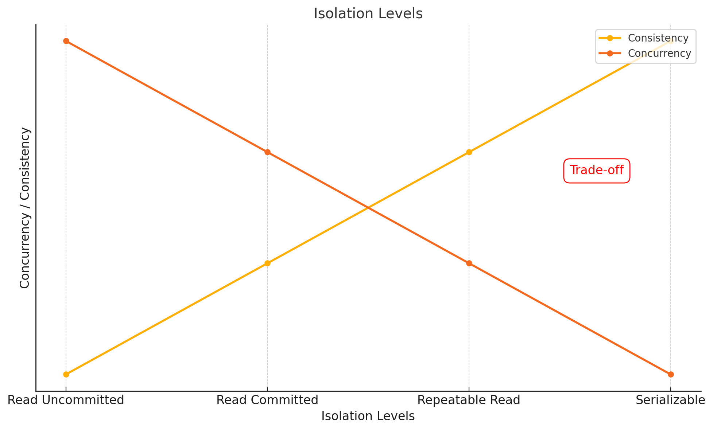
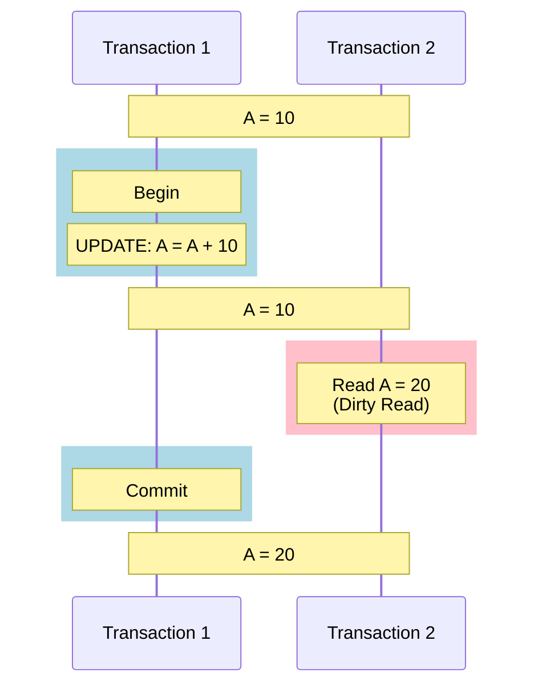
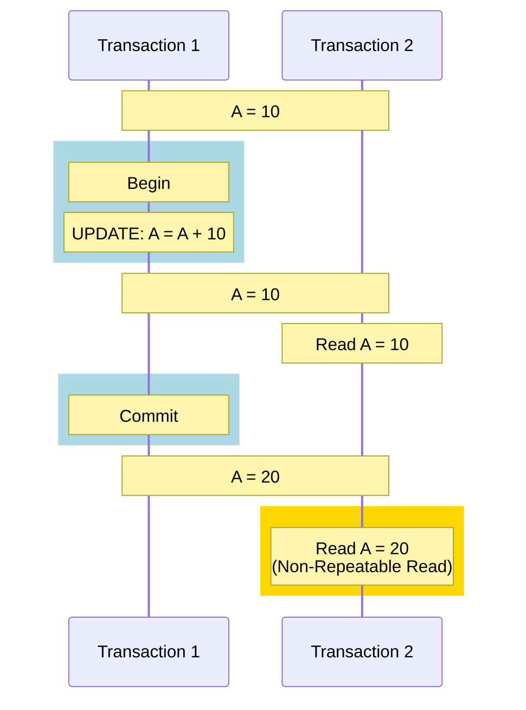
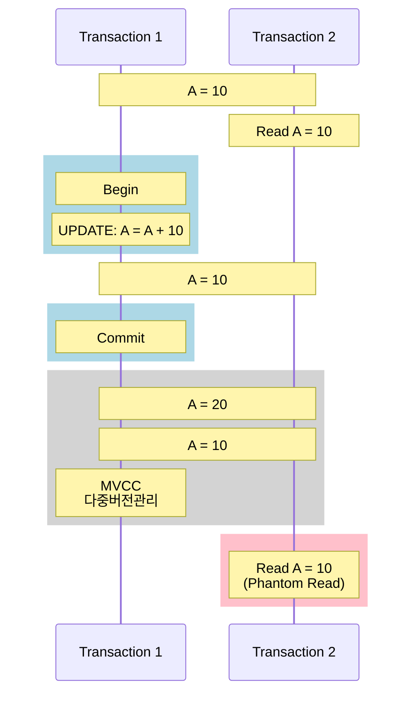
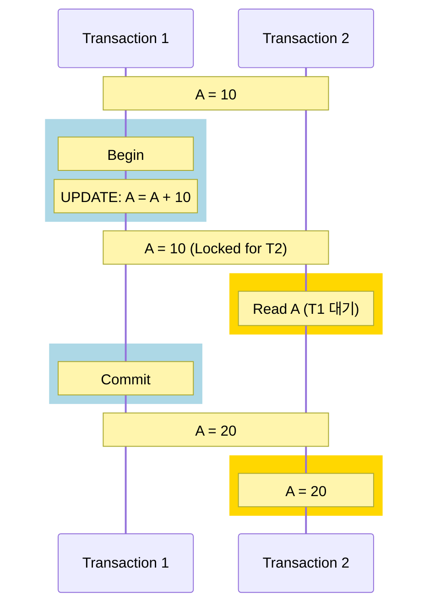

## 트랜잭션 격리수준 개념

- 병행 트랜잭션 실행 시 데이터를 일관성 있게 읽을 수 있도록 ==고립성을 유지하기 위한 데이터 허용 수준==
- Dirty Read, Non-Repeatable Read, Phantom Read 등 이상 현상 발생 가능

## 트랜잭션 격리 수준 상세

### Read Uncommitted

- 트랜잭션이 완료되지 않은 데이터를 다른 트랜잭션이 참조하는 것을 허용하는 격리수준

### Read Committed

- 트랜잭션이 완료된 데이터만 읽을 수 있는 격리 수준

### Repeatable Read

- 동일한 행을 여러 번 읽을 때 항상 동일한 값을 반환하도록 보장하는 격리수준

### Serializable

- 여러 트랜잭션이 순차적으로 하나씩 실행되도록 보장하는 격리수준
- 동시성이 낮아 거의 사용되지 않음

## 트랜잭션 격리수준 고려사항

- Locking, 2PL, Timestamp Ordering, 낙관적 기법 등 병행제어 필요
