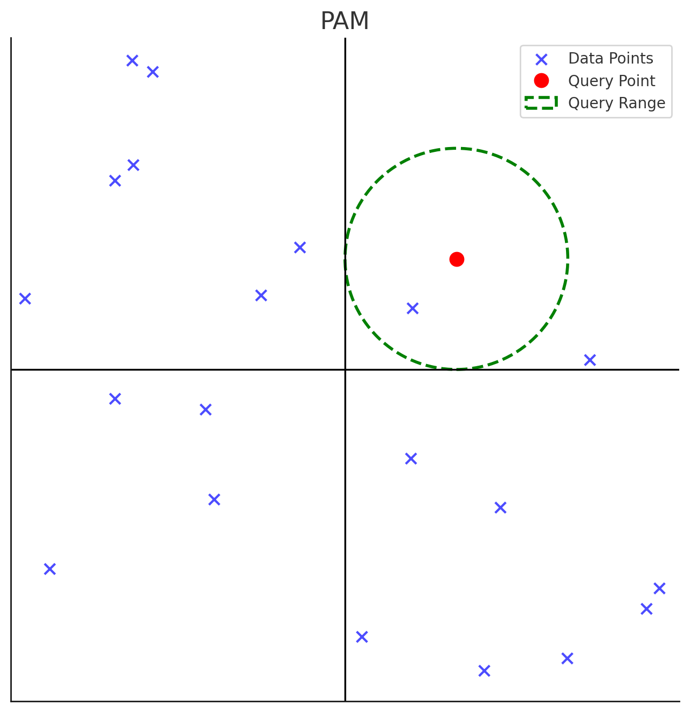
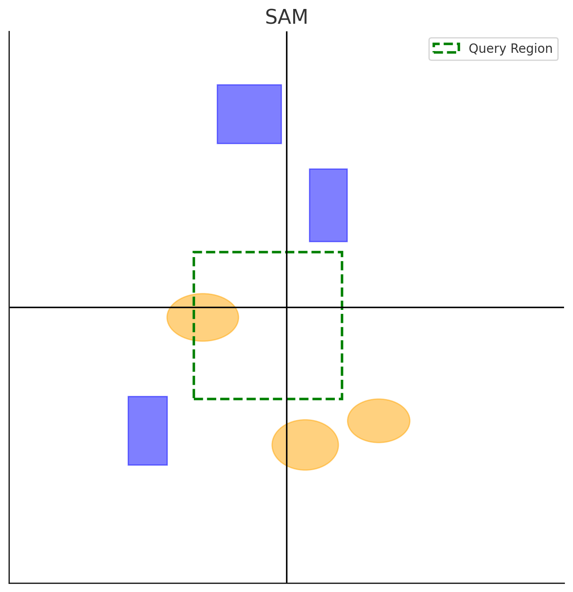

## 다차원 색인구조 개념

- 이미지나 멀티미디어 등 비정형 데이터의 효율적 검색을 위해 다차원 필드를 동시에 키로 사용한 색인 구조
- 차원확장성, 유사성 기반 내용 검색, 다양항 데이터 처리, 저장공간 절감, RAG, Vector DB 활용

## 다차원 색인구조 유형

| 구분 | 개념도 | 설명 |
| --- | --- | --- |
| Point Access Method (PAM) |  | 다차원 점 데이터 저장 및 검색 K-D 트리, K-D-B 트리, Grid File, 사분트리 |
| Spatial Access Method (SAM) |  | 선, 면 등 크기를 갖는 다차원 공간 데이터 저장 및 검색 R-Tree, R*-Tree, R+Tree, X-Tree |

## 다차원 색인구조 상세

### PAM 기반 다차원 색인구조

### SAM 기반 다차원 색인구조

## 다차원 색인구조 활용분야

| 구분 | 사례 | 설명 |
| --- | --- | --- |
| 지리 정보 | GIS | R트리 활용 지리 정보 저장 및 검색 |
| - | 위성영상분석 | 사분트리, 위성데이터 분할 저장 |
| 멀티미디어 | 이미지 | K-D 트리, 사분 트리, 이미지 속성 저장 |
| - | 비디오 | K-D 트리, 메타데이터 인덱싱 |
