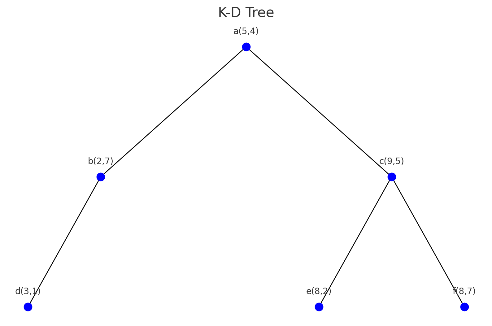
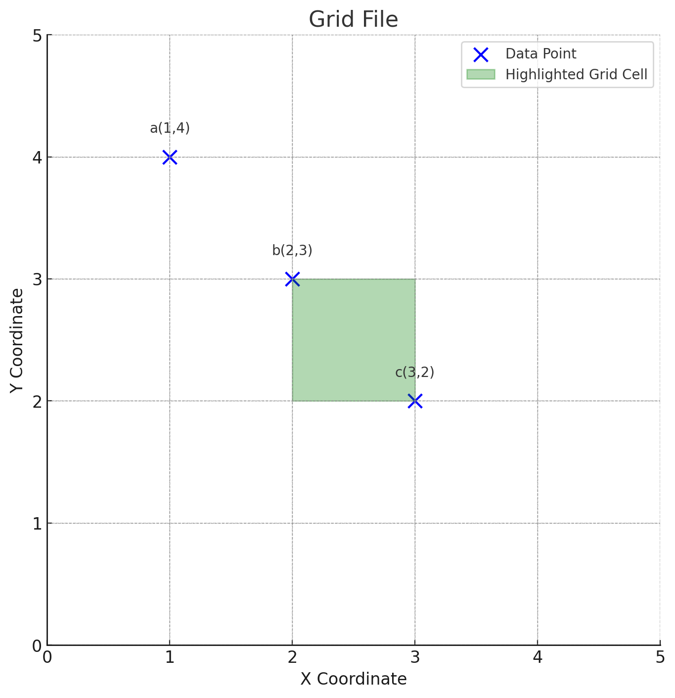
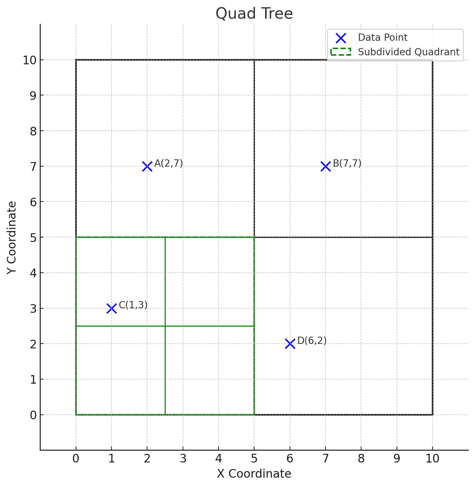
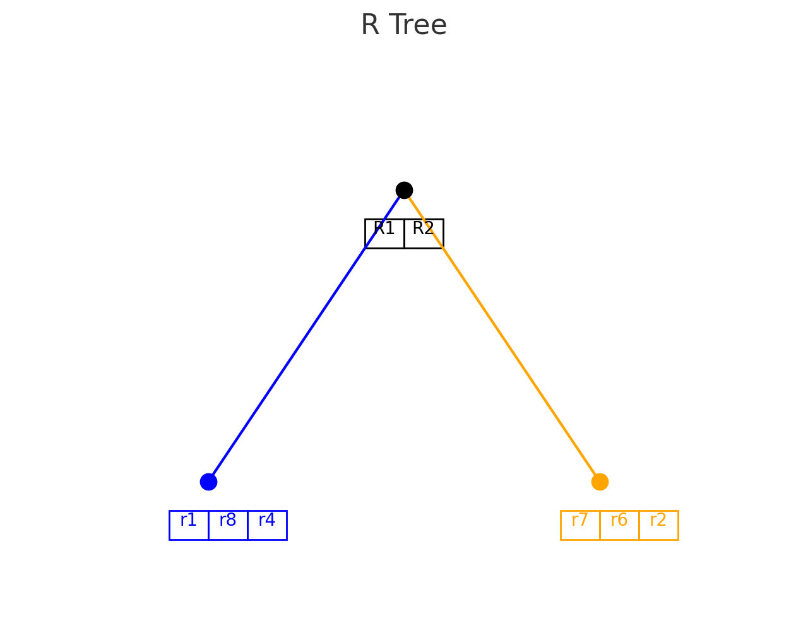
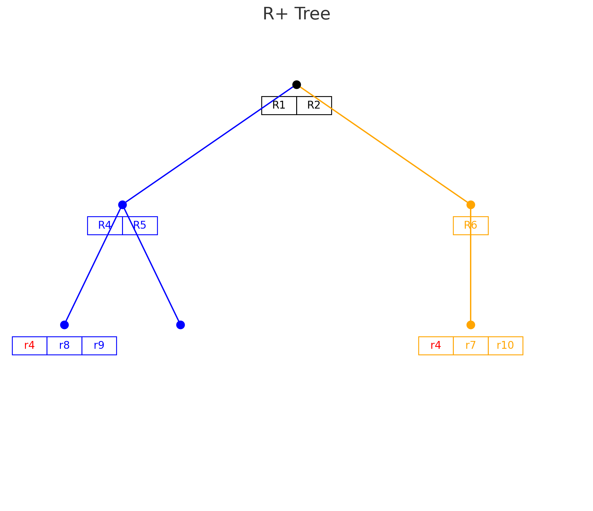

## 다차원 색인구조 개념

- 이미지나 멀티미디어 등 비정형 데이터의 효율적 검색을 위해 다차원 필드를 동시에 키로 사용한 색인 구조
- 차원확장성, 유사성 기반 내용 검색, 다양항 데이터 처리, 저장공간 절감, RAG, Vector DB 활용

## 다차원 색인구조 유형

| 구분 | 개념도 | 설명 |
| --- | --- | --- |
| Point Access Method (PAM) |  | 다차원 점 데이터 저장 및 검색 K-D 트리, K-D-B 트리, Grid File, 사분트리 |
| Spatial Access Method (SAM) |  | 선, 면 등 크기를 갖는 다차원 공간 데이터 저장 및 검색 R-Tree, R*-Tree, R+Tree, X-Tree |

## 다차원 색인구조 상세

### PAM 기반 다차원 색인구조

| 구분 | 개념도 | 설명 |
| --- | --- | --- |
| K-D 트리 |  | 이진탐색트리 BST를 다차원 확장하여 K차원 점 데이터 색인 트리 레벨과 값을 번갈아 비교 |
| Grid File |  | 데이터포인트를 다차원 그리드 공간에 매핑하여 저장 각 차원 범위를 선형눈금계로 나눠 격자 배열 생성 |
| 사분트리 |  | 공간을 반복적으로 4개의 하위 영역으로 분할하는 자료구조 고차원 데이터 부적합, 공간 분할로인한 비효율적 메모리 사용 |

### SAM 기반 다차원 색인구조

| 구분 | 개념도 | 설명 |
| --- | --- | --- |
| R 트리 |  | MBR을 구하여 인덱스를 엔트리로 저장하는 자료구조 완전균형트리로 데이터 객체를 여러 차원의 구간들로 표현 |
| R+ 트리 |  | 여러 MBR과 중첩되는 데이터는 여러 노드에 중복 저장하는 자료구조 K-D 트리와 R 트리의 중간 형태 |
| R* 트리 | - | R 트리와 구조, 연산은 유사하나 삽입 삭제시 노드 간 MBR 중첩 최소화한 자료구조 |

- X 트리는 고차원 데이터를 다루는 슈퍼노드를 사용한 R 트리 확장 구조

## 다차원 색인구조 활용분야

| 구분 | 사례 | 설명 |
| --- | --- | --- |
| 지리 정보 | GIS | R트리 활용 지리 정보 저장 및 검색 |
| - | 위성영상분석 | 사분트리, 위성데이터 분할 저장 |
| 멀티미디어 | 이미지 | K-D 트리, 사분 트리, 이미지 속성 저장 |
| - | 비디오 | K-D 트리, 메타데이터 인덱싱 |
