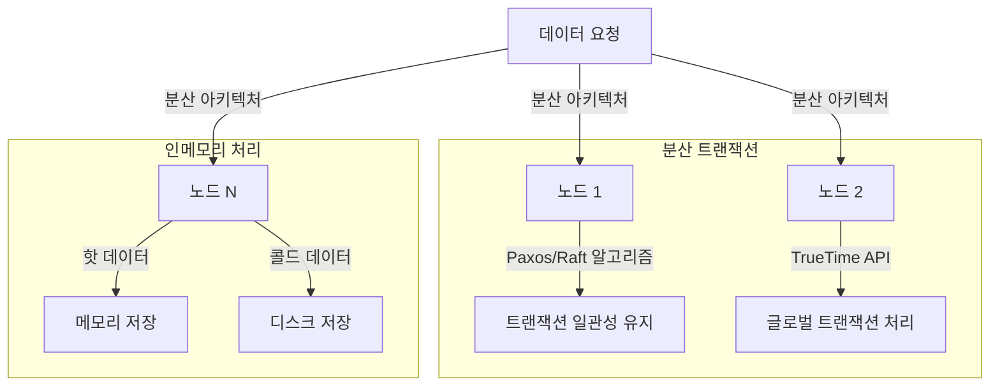

## NewSQL 개념

- 전통적인 RDBMS의 ACID(Atomicity, Consistency, Isolation, Durability) 특성을 유지하면서, NoSQL의 확장성을 결합한 차세대 데이터베이스 시스템
- 고성능 트랜잭션 처리(RDBMS 확장제한, NoSQL 일관성 보장어려움) / 수평적 확장 지원 / 실시간 데이터 분석 요구 증가

## NewSQL 동작 매커니즘, 동작 원리, 기존 DB 비교

### NewSQL 동작 매커니즘

### NewSQL 동작 원리

| 설계 원리 | 설명 | 예시 |
| --- | --- | --- |
| 분산 아키텍처 | 데이터를 여러 노드에 분산 저장하여 수평적 확장성 제공 | CockroachDB의 자동 샤딩 |
| ACID 준수 | 트랜잭션의 원자성, 일관성, 격리성, 지속성을 보장 | Google Spanner의 글로벌 트랜잭션 |
| 병렬 처리 | 다중 쿼리를 병렬로 처리하여 성능 극대화 | MemSQL의 실시간 분석 쿼리 |
| 인메모리 기술 | 데이터를 메모리에서 처리하여 접근 속도 향상 | VoltDB의 초당 수백만 건 처리 |

### NewSQL과 RDBMS 비교

| 구분 | 기존 RDBMS 한계 | NewSQL 개선점 |
| --- | --- | --- |
| 분산 트랜잭션 | 단일 서버 기반으로 물리적 한계 존재 | Paxos/Raft 알고리즘 활용, TrueTime API 적용 |
| 인메모리 처리 | 디스크 I/O 병목 발생 | 핫 데이터를 메모리에서 처리, I/O 병목 제거 |
| 자동 샤딩 | 수직적 확장으로 확장성 제한 | 자동 샤딩으로 데이터 균등 분배, 다운타임 최소화 |
| 하이브리드 저장소 | 모든 데이터 동일 계층 저장 | 핫/콜드 데이터 분리로 비용 효율성 강화 |
| 병렬 처리 | 단일 노드에서 병렬성 제한 | 다중 노드에서 분석 쿼리 병렬 처리 |

## NewSQL 도입 효과

| 산업 | 적용 방법 | 효과 |
| --- | --- | --- |
| 금융 서비스 | 글로벌 트랜잭션 시스템 구축 | HSBC의 성능 및 신뢰성 강화 |
| 전자상거래 | 실시간 주문 및 재고 관리 | Shopify의 CockroachDB 글로벌 주문 처리 최적화 |
| IoT 플랫폼 | 센서 데이터 실시간 분석 | VoltDB의 초당 수백만 건 이벤트 처리 |
