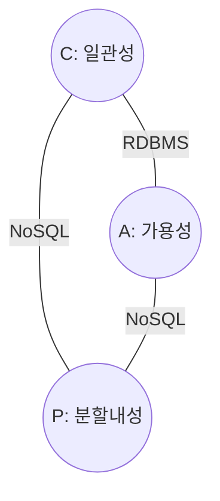

## NoSQL의 개념

- 전통적인 RDBMS의 한계 극복을 위해 비정형 데이터를 다양한 형태로 저장하고 유연한 데이터 모델을 제공하는 데이터베이스
- 대규모 데이터 R/W 처리 한계 극복, 클라우드 분산 환경 확장성 한계 극복, 스키마 유연성

## NoSQL의 BASE특성, 유형

### NoSQL의 BASE 특성

| 구분                 | 내용                                        | 비고                        |
| -------------------- | ------------------------------------------- | --------------------------- |
| Basically Available  | 시스템 장애에도 부분적으로 데이터 접근 가능 | 모든 요청 응답, 가용성 중시 |
| Soft State           | 데이터 일관성이 즉시 보장되지 않음          | 최종적 일관성               |
| Eventual Consistency | 모든 복제물이 결국에는 동일한 상태로 수렴   | 일관성 완화                 |

### NoSQL의 유형

| 구분          | 내용                                              | 비고             |
| ------------- | ------------------------------------------------- | ---------------- |
| Key-Value     | 키와 값의 간단한 쌍으로 저장, 빠른 조회 가능      | Redis, DynamoDB  |
| Column Family | 열 기반 데이터 저장, 유연한 스키마                | Cassandra, HBase |
| Document      | JSON 문서 형식으로 저장, 빠른 조회 가능           | MongoDB, CouchDB |
| Graph         | 노드와 간선으로 구성된 그래프 형식의 데이터베이스 | Neo4j            |

## NoSQL의 CAP 이론, 유형

### CAP 이론

| 구성                | 내용                                       |
| ------------------- | ------------------------------------------ |
| Consistency         | 모든 사용자는 항상 동시에 같은 데이터 조회 |
| Availability        | 모든 요청이 장애시에도 동작                |
| Partition Tolerance | 물리적 분할에도 시스템 동작                |

- CAP 중 2가지만 만족 가능

### CAP 유형

| 구분  | 내용                                                           | 비고              |
| ----- | -------------------------------------------------------------- | ----------------- |
| C + P | 네트워크 분할시에도 일관성을 보장, 가용성 일부 희생            | HBase, MongoDB    |
| A + P | 네트워크 분할시에도 가용성을 보장, 일관성 일부 희생            | CouchDB, DynamoDB |
| C + A | 네트워크 분할 발생하지 않는 상황에서 일관성과 가용성 모듀 우지 | RDBMS             |

## NoSQL 모델링시 고려사항

- 비정형 데이터를 저장해야하므로 도메인 모델링 후 쿼리 결과를 정의한 뒤 저장할 테이블 모델을 설계해야함.
