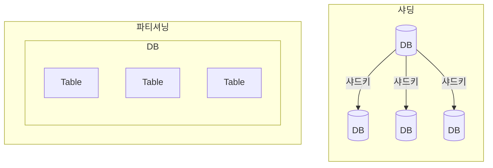

## 샤딩, 파티셔닝 개념

- 파티셔닝: 큰 테이블을 관리하기 쉬운 단위로 분할하는 기법
- 샤딩: 테이블을 분리하여 다수의 물리DB서버에 분산 저장하는 기법

## 샤딩, 파티셔닝 구성요고, 주요 데이터베이스 분할 기법

### 샤딩, 파티셔닝 구성요소 비교

| 구분 | 샤딩 | 파티셔닝 |
| --- | --- | --- |
| 목적 | 데이터 분산저장, 고가용성, 성능 | 데이터 관리용이, 성능 |
| 분할방법 | 수평분할 | 수평, 수직분할 |
| 분할관점 | 테이블을 여러 DB로 분할 | 하나의 DB에서 테이블 분할 |
| 관리노드 | 샤드간 라우팅 수행용 마스터 | 마스터노드 없음 |
| 테이블연동 | 분할 테이블 간 조인 불가 | 테이블 간 조인 가능 |

### 주요 데이터베이스 분할 기법

| 구분 | 내용 | 비고 |
| --- | --- | --- |
| Vertical 분할 | 테이블별, 열별 분할 | 구현 간단 |
| Range-Based 분할 | 하나의 기능이나 테이블이 비대해질시 행 분할 | 예측 가능성 |
| Key 또는 Hash 분할 | 엔티티를 해싱하여 분할 결정 | 균등분포 해싱함수 |
| Directory 기반 분할 | 파티셔닝 매커니즘을 제공하는 추상화된 서비스를 사용하여 분할 | 샤딩 사용, 샤드키 연동 |

## 데이터베이스 분할 절차도, 세부절차

### 데이터베이스 분할 절차도

### 데이터베이스 분할 세부절자

| 구분 | 내용 | 비고 |
| --- | --- | --- |
| 1. 분할 필요성 증가 | - | - |
| 2. 분할 방법 결정 | - | - |
| 3. AS-IS 성능 측정 | - | - |
| 4. 분할 적용, 이관 | - | - |
| 5. 어플리케이션 수정 | - | - |
| 6. 테스트, 모니터링 | - | - |

## 데이터베이스 분할시 고려사항
